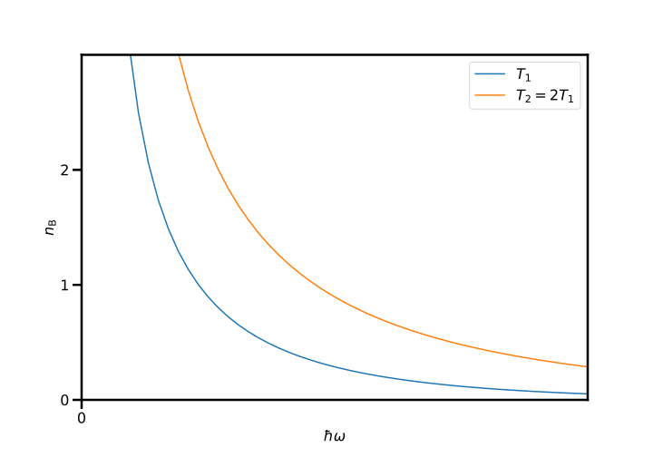

# The specific heat of solids I

## Exercises

### Preliminary provocations

  1. What is the high-temperature heat capacity of an atom in a solid with two momentum and two spatial coordinate degrees of freedom?

    The heat capacity is given by the equipartition theorem, which tells us that each degree of freedom contributes $k_\mathrm{B} T/2$ to the total energy and thus for 4 degrees of freedom, we have $C = 2 k_\mathrm{B}$ per atom

  2. Sketch the Bose-Einstein distribution as a function of $\omega$ for two different values of $T$

    {: .center}

### Exercise 1: Total heat capacity of a diatomic material

One of the assumptions of the Einstein model states that every atom in a solid oscillates with the same frequency $\omega_0$. However, if the solid contains different types of atoms, it is unreasonable to assume that the atoms oscillate with the same frequency. One example of such a solid is a lithium crystal, which consists of the [two stable isotopes](https://en.wikipedia.org/wiki/Isotopes_of_lithium) $^6$Li (7.5%) and $^7$Li (92.5%) in their natural abundance. Let us extend the Einstein model to take into account the different masses of these different isotopes. Assume that the solid is 1D (1D quantum harmonic oscillator).

  1. Assume that the strength of the returning force $\kappa$ experienced by each atom is the same. What is the difference in the oscillation frequencies of the two different isotopes in the lithium crystal?

    The oscillation frequency for a spring with spring constant $\kappa$ and mass $m$ is

    $$
    \omega = \sqrt{\frac{\kappa}{m}}
    $$

    so this implies that

    $$
    \frac{\omega_{\mathrm{Li-6}}}{\omega_{\mathrm{Li-7}}} = \sqrt{\frac{7}{6}} \approx 1.08
    $$

    as we are assuming that $\omega$ is the same.

  2. Write down the total energy stored in the vibrations of each atom of the lithium crystal, assuming that all $^6$Li atoms are in $n=2$ vibrational mode and all $^7$Li atoms are in $n=4$ vibrational mode.

    $$
    \begin{align}
    E_{\mathrm{Total}} & = \frac{N_{\textrm{Li-6}}}{N}\hbar\omega_{\textrm{Li-6}}(2 + 1/2) + \frac{N_{\textrm{Li-7}}}{N}\hbar\omega_{\textrm{Li-7}}(4 + 1/2) \\
    & = 0.075 \times \frac{5}{2} \times \hbar\omega_{\textrm{Li-6}} + 0.925 \times \frac{9}{2}\times \hbar\omega_{\textrm{Li-7}}
    \end{align}
    $$

  3. In the case where the oscillators can occupy any vibrational mode, write down the total energy stored in the vibrations of each atom in the lithium crystal at a temperature $T$ by modifying the Einstein model.

    $$
    E = \frac{N_{\textrm{Li-6}}}{N}\hbar\omega_{\textrm{Li-6}}\left(n_{\textrm{B}}(\beta\hbar\omega_{\textrm{Li-6}}) + \frac{1}{2}\right) + \frac{N_{\textrm{Li-7}}}{N}\hbar\omega_{\textrm{Li-7}}\left(n_{\textrm{B}}(\beta\hbar\omega_{\textrm{Li-7}}) + \frac{1}{2}\right).
    $$

    where

    $$
    n_{\textrm{B}} = \frac{1}{\exp(x)-1}
    $$

  4. Compute the heat capacity of the lithium crystal as a function of $T$.

    The heat capacity per atom is given by

    $$
    C = \frac{N_{\textrm{Li-6}}}{N}C_{\textrm{Li-6}} + \frac{N_{\textrm{Li-7}}}{N}C_{\textrm{Li-7}},
    $$

    where

    $$
    C_{\textrm{Li-x}} = \frac{\partial\langle E_{\textrm{Li-x}}\rangle}{\partial T}
    $$
