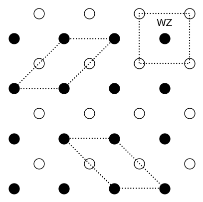

---
search:
  exclude: true
---

# Crystals

## Exercises

### Preliminary provocations

  1.  State the definition of a primitive unit cell. What can be said about its volume?

      A primitive unit cell is a unit cell which contains a single lattice point. Because it only contains a lattice point, it is the unit cell with the smallest volume out of all unit cells.

  2.  Draw the conventional unit cell of a FCC and the BCC. Write down the primitive lattice vectors and the basis of each lattice.

      Let us first consider the FCC lattice. Its primitive lattice vectors vectors are

      \begin{align}
      \mathbf{a}_1 &= \frac{a}{2}(\mathbf{\hat{x}} + \mathbf{\hat{y}})\\
      \mathbf{a}_2 &= \frac{a}{2}(\mathbf{\hat{x}} + \mathbf{\hat{z}})\\
      \mathbf{a}_3 &= \frac{a}{2}(\mathbf{\hat{y}} + \mathbf{\hat{z}}).
      \end{align}

      With respect to the conventional unit cell, the basis in fractional coordinates is $\bigcirc(1/2,1/2,0)$, $\bigcirc(1/2,0,1/2)$, $\bigcirc(0,1/2,1/2)$ and $\bigcirc(0,0,0)$. With respect to the primitive unit cell, the basis is $\bigcirc(0,0,0)$.

      Let us now consider the BCC lattice. The primitive lattice vectors are

      \begin{align}
      \mathbf{a}_1 &= \frac{a}{2}(\mathbf{\hat{x}} + \mathbf{\hat{y}} + \mathbf{\hat{z}})\\
      \mathbf{a}_2 &= a\mathbf{\hat{x}}\\
      \mathbf{a}_3 &= a\mathbf{\hat{y}}.
      \end{align}

      The basis of the conventional unit cell is $\bigcirc(0,0,0)$ and $\bigcirc(1/2,1/2,1/2)$.
      For the primitive unit cell the basis is $\bigcirc(0,0,0)$.

  3.  Suppose you find the primitive unit cell of a diatomic crystal. How many basis vectors do you minimally need to describe the crystal? Can a diatomic crystal require more basis vectors?

      You would need at least two. A diatomic crystal could require more than two basis vectors if the atoms as determined by the spatial location of the atoms. One needs to be able to construct all atoms in the crystal using a basis plus a lattice.

  4.  Calculate the filling factor of a simple cubic lattice.

      The filling factor is

      $$
      F = \frac{\pi}{6}
      $$

  5.  Sketch the $(110),(1\bar{1}0),(111)$ miller planes of a simple cubic lattice.

### Exercise 1: Diatomic crystal

Consider the following two-dimensional diatomic crystal:

<figure>
  
</figure>

  1.  Sketch the Wigner-Seitz unit cell and two other possible primitive unit cells of the crystal.

      <figure>
        
      </figure>

  2.  If the distance between the filled circles is $a=0.28$ nm, what is the area of the primitive unit cell? How would this area change if all the empty circles and the filled circles were identical?

      If the filled and empty circles are identical particles, the nearest-neighbour distance becomes $a^* = \frac{a}{\sqrt{2}}$ and thus the area $A^* = {a^*}^2 = \frac{a^2}{2} = \frac{A}{2}$.

  3.  Write down one set of primitive lattice vectors and the basis for this crystal. What happens to the number of elements in the basis if all empty and filled circles were identical?

      One set of primitive lattice vectors is

      $$
      \mathbf{a_1} = a \hat{\mathbf{x}}, \quad \mathbf{a_2} = a \hat{\mathbf{y}}.
      $$

      With respect to the primitive lattice vectors, the basis is

      $$
      \huge \bullet \normalsize(0,0), \quad \bigcirc(\frac{1}{2},\frac{1}{2}).
      $$

  4.  Imagine expanding the lattice into the perpendicular direction $z$. We can define a new three-dimensional crystal by considering a periodic structure in the $z$ direction, where the filled circles have been displaced by $\frac{a}{2}$ in both the $x$ and $y$ direction from the empty circles. The figure below shows the new arrangement of the atoms. What lattice do we obtain? Write down the basis of the three-dimensional crystal.

      <object type="text/html" data="../../4-crystal/images/4-1-diatomic.html"  frameborder="0" width=650 height=650 class=center></object>

      The lattice is a cubic lattice. The basis of the crystal is

      $$
      \huge \bullet \normalsize(0,0,0), \quad \bigcirc(\frac{1}{2},\frac{1}{2},\frac{1}{2}).
      $$

      An example of such a material is Caesium Chloride (CsCl)

  5.  If we consider all atoms to be the same, what lattice do we obtain? Compute the filling factor in the case where all atoms are the same.

      We obtain the BCC lattice. Example: Sodium (Na)

      The filling factor is

      $$
      F = \frac{\sqrt(3)\pi}{8}
      $$

### Exercise 2: Diamond lattice

Consider a the [diamond crystal structure](https://en.wikipedia.org/wiki/Diamond_cubic) structure. The following illustration shows the arrangement of the carbon atoms in a conventional unit cell.

<object type="text/html" data="../../4-crystal/images/4-1-diamond.html"  frameborder="0" width=650 height=650 class=center></object>

The side of the cube is $ a = 0.3567$ nm.

  1.  How is this crystal structure related to the fcc lattice? Write down one set of primitive lattice vectors and compute the volume of the corresponding primitive unit cell.

      The conventional unit cell of diamond consists of two intertwined fcc lattices. A possible set of primitive lattice vectors is

      \begin{align}
      \mathbf{a_1} &= \frac{a}{2} \left(\hat{\mathbf{x}}+\hat{\mathbf{y}} \right) \\
      \mathbf{a_2} &= \frac{a}{2} \left(\hat{\mathbf{x}}+\hat{\mathbf{z}} \right) \\
      \mathbf{a_3} &= \frac{a}{2} \left(\hat{\mathbf{y}}+\hat{\mathbf{z}} \right).
      \end{align}

      The volume of the primitive unit cell is

      $$
      V = \left| \mathbf{a_1} \cdot \left(\mathbf{a_2} \times \mathbf{a_3} \right) \right| = \frac{a^3}{4}
      $$

      as expected because the conventional unit cell contains 4 lattice points.

  2.  How many atoms are in the primitive unit cell? Write down the basis.

      The primitive unit cell contains 2 atoms. With respect to the set of primitive lattice vectors, the basis is $ \mathrm{C}(0,0,0)$ and $\mathrm{C}(\frac{1}{4},\frac{1}{4},\frac{1}{4})$.

  3.  Determine the number of atoms in the conventional unit cell and compute its volume.

      The conventional unit cell of the FCC lattice contains 4 atoms. Because the diamond conventional unit cell contains two shifted FCC lattices, it contains 8 atoms. The volume of the conventional unit cell is $V = a^3$.

  4.  What is the distance between nearest neighbouring atoms?

      We identify a nearest neighbour pair consisting of the atom at the origin and the atom at (0.25a,0.25a,0.25a). Therefore the distance between nearest neighbouring atoms is $d = \frac{\sqrt{3}a}{4}$

  5.  Compute the filling factor.

      The atom density is $\rho=N_\text{atom}/a^3 = 175/$ nm$^3$. The filling factor is

      $$
      F = \frac{\sqrt{3}\pi}{16}
      $$
