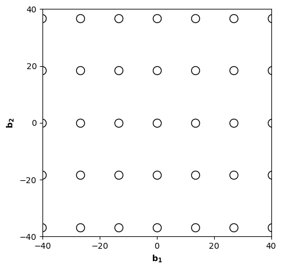
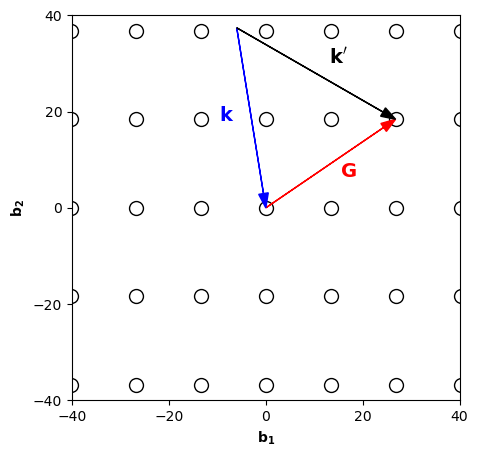

## Exercises

### Preliminary provocations

  1.  Why is the amplitude of a scattered wave zero if $\mathbf{k'}-\mathbf{k} \neq \mathbf{G}$?

      If $\mathbf{k}-\mathbf{k'}\neq \mathbf{G}$, then the argument of the exponent in the sum  $\sum_\mathbf{R}\mathrm{e}^{i\left((\mathbf{k'}-\mathbf{k})\cdot\mathbf{R}-\omega t\right)}$ represents a phase that depends on the location $\mathbf{R}$ of the real-space lattice point. Because we sum over all lattice points, each argument has a different phase. Summing over all these phases results in a total amplitude of 0, resulting in no intensity peaks.

  2.  Suppose we have a unit cell with a single atom in it. Can any intensity peaks disappear as a result of the structure factor?

      No, there is a single atom, and thus only one term in the structure factor. Therefore the structure factor is non-zero.

  3.  Can increasing the unit cell in real space introduce new diffraction peaks due to reciprocal lattice having more points?

      No, an increase of the unit cell size cannot create new diffraction peaks (see lecture). Even though the increase leads to extra reciprocal lattice points, the structure
      factor will cancel their contributions to the scattered wave amplitudes.

### Exercise 1: X-ray scattering in 2D

  Using x-ray scattering, we can infer information on the crystal structure of a material. Here we visualize the geometry of this procedure by analyzing an elementary 2D crystal structure.

  Consider a two-dimensional crystal with a rectangular lattice and primitive lattice vectors $\mathbf{a}_1 = d_1\mathbf{\hat{x}}$ and $\mathbf{a}_2 = d_2\mathbf{\hat{y}}$, where $d_1=0.47$ nm and $d_2=0.34$ nm. We conduct an X-ray scattering experiment using monochromatic X-rays with wavelength $\lambda = 0.166$ nm. The wavevectors of the incident and reflected X-ray beams are $\mathbf{k}$ and $\mathbf{k'}$ respectively.

  1.  Calculate the reciprocal lattice vectors and sketch both the real- and the reciprocal lattice of this crystal.

    {: .center}

  2.  Consider an X-ray diffraction experiment performed on this crystal using monochromatic X-rays with wavelength $\lambda = 0.166$ nm. By assuming elastic scattering, find the magnitude $k$ of the wavevectors of the incident and reflected X-ray beams.

      Since we have elastic scattering, we have $|\mathbf{k}| = |\mathbf{k}'| = \frac{2 \pi}{\lambda} = 37.9 nm^{-1}$

  3.  In the sketch of the real-space lattice of subquestion 1, indicate a (210) Miller plane. Indicatet the associated reciprocal lattice vector $\mathbf{G}$ in the sketch of the reciprocal lattice. Also sketch the "scattering triangle" formed by the vectors $\mathbf{k}$, $\mathbf{k'}$, and $\mathbf{G}$ corresponding to diffraction from (210) planes.

      We can draw the (210) Miller plane using its intersections with the lattice vectors. We plot the scattering triangle in the figure below

    {: .center}

  4.  Sketch the first 5 peaks in an x-ray powder diffraction spectrum of this crystal as a function of $\sin 2\theta$, where $\theta$ is the deflection angle. Label the peaks according the Miller indices. Make sure you have the correct order of the peaks. Are there missing peaks because of the structure factor?

      Since there is only 1 atom in the basis, there are no missing peaks due to a structure factor. We will get diffraction peaks at angles given by Bragg's law $\sin2\theta = \lambda/d_{hkl} = \lambda |\mathbf{G_{hkl}}|/2\pi$. We see that the shortest reciprocal lattice vector gives the smallest angle. Therefore, as a function of increasing $\theta$, we will see peaks at $(hkl)= (100) \quad (010) \quad (110) \quad (200), (020)$, where we took into account that $|\mathbf{b_1}|<|\mathbf{b_2}|$.

### Exercise 2: Structure factors and powder diffraction

  In this question, we analyse the diffraction pattern we expect for an x-ray experiment on a 3D material with a BCC crystal structure.

  1.  Using a conventional unit cell plus a basis to construct the BCC crystal structure, calculate the structure factor $\mathbf{S}$. (assume all the atoms to be the same).

      The structure factor is $S(\mathbf{G}) = \sum_j f_j e^{i \mathbf{G} \cdot \mathbf{r_j}} = f(1 + e^{i \pi (h+k+l)})$

  2.  Which diffraction peaks are missing because of the structure factor? Discuss why they are missing in relation to the crystal structure and the conventional unit cell.

      Solving for $h$, $k$, and $l$ results in

      $$
      S(\mathbf{G}) = \begin{cases}
          2f, \: \text{if $h+k+l$ is even}\\
          0, \: \text{if $h+k+l$ is odd}.
      \end{cases}
      $$

  3.  How does this structure factor change if the atom in the centre of the conventional unit cell has a different form factor from the atoms at the corners?

      Let $f_1 \neq f_2$, then

      $$
      S(\mathbf{G}) = \begin{cases}
      f_1 + f_2, \text{if $h+k+l$ is even}\\
      f_1 - f_2, \text{if $h+k+l$ is odd}
      \end{cases}       
      $$

  4.  A student carried out an X-ray powder diffraction experiment on chromium (Cr) which is known to have a BCC structure. The measured spectrum is shown given below. Furthermore, the student assigned Miller indices to the peaks. Were these indices assigned correctly? Fix any mistakes and explain your reasoning.

    

      Due to the systematic absences of peaks caused by the structure factor, the peaks from lowest to largest angle are:
$(110),(200),(211), (220), (310)$

  5.  Calculate the lattice constant $a$ of the conventional chromium bcc unit cell. Use that the X-ray diffraction experiment was carried out using Cu K-$\alpha$ (wavelength $\lambda = 1.5406$ Å) radiation.

      We use $d_{hkl} = \lambda /(2\sin\theta)$. We can for instance read off from the graph that $\theta = 32$ deg. for the $(hkl) =(200)$ peak, which gives $d_{200} = 0.145$ nm, and therefore the side-length of the conventional unit cell is $a=0.29$ nm.
