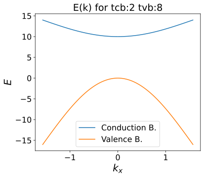

---
search:
  exclude: true
---

# Semiconductors 101

### Preliminary provocations

  In this set of warm-up exercises we consider a two-dimensional semiconductor.

  1. Write down an integral expression for the number of electrons in the conduction band. How does the dimensionality come in?

    The dimensionality of the system enters the integral implicitly with the density of states, which in 2D and expressed per unit volume is a constant:

    $$
    g_{2 D}(E)=\frac{2_s}{2 \pi} \frac{m}{\hbar^2}
    $$

    $$
    n_e = \int_{E_c}^\infty f(E)g_e(E)dE = \int_{E_c}^\infty\frac{m_e}{\pi\hbar^2}\frac{1}{e^{(E-E_F)/k_BT}+1}dE.
    $$

  2. Write down an integral expression for the number of holes in the valence band.

    Following the derivation in the lecture notes, whenever calculating the hole-dependent quantities, replace all relevant physical quantities with their hole equivalents.

    1. For example, state the integral in terms of the electron energy scale using $E \equiv E_e $ and $E_F \equiv E_{F,e}$ with $f_n(E) = 1 -f(E)$:
        $$
        n_h = \int_{-\infty}^{E_v} f_h(E)g_h(E)dE  = \int_{-\infty}^{E_v}\frac{m_h}{\pi\hbar^2}\left(\frac{1}{e^{-(E-E_F)/k_BT}+1}\right)dE
        $$    
    2. Next, using $E_h = -E$, change the integration element and the corresponding integration limits, and the energy variable:
        $$
        n_h = \int_{-E_v}^\infty\frac{m_h}{\pi\hbar^2}\frac{1}{e^{(E_h+E_F)/k_BT}+1}dE_h,
        $$

      remembering that $E_{F,h} = - E_F$.

  3. Make a sketch of the density of states (=band structure) of this semiconductor.

      {: .center}

  4. Solve the integrals of questions 1 and 2 assuming the Fermi energy is in the gap and far away from the band edges compared to $k_bT$.

      Assuming that the Fermi energy is in the gap $(E_v < E_F < E_c)$ and far away from the band edges compared to $k_BT$;

      $$
      E_F-E_v \gg k_BT \text{ and } E_c - E_F \gg k_BT,
      $$

      the Fermi-Dirac distribution can be approximated as Boltzmann distribution:

      $$
      f(E)_{e/h} \approx \exp\left[-(E_{e/h}\pm E_F)/k_BT\right].
      $$

      and the integrals for $n_h$ and $n_e$ simplify to:

      $$
      n_h \approx \int_{-E_v}^\infty\frac{m_h}{\pi\hbar^2}e^{-(E_h+E_F)/k_BT}dE_h = N_V e^{(E_v-E_F)/k_BT}
      $$

      $$
      n_e \approx \int_{E_c}^\infty\frac{m_e}{\pi\hbar^2}e^{-(E-E_F)/k_BT}dE = N_C e^{-(E_c+E_F)/k_BT}
      $$

      where

      $$
      N_{V,C}= \frac{m_{h,e} k_B T}{\pi\hbar^2}
      $$

  5. Find the Fermi energy

    Under the assumption of the charge balance ($n_e = n_h$), the Fermi energy can be found by dividing the results of the previous question:
    $$
    1 = \frac{n_h}{n_e} = \left(\frac{N_V}{N_C}\right) e^{(E_v+E_c-2E_F)/k_BT} = \left(\frac{m_h}{m_e}\right) e^{(E_v+E_c-2E_F)/k_BT},
    $$
    and taking the logarithm of both sides of the equation:
    $$
    E_F = \frac{E_V+E_C}{2} + \frac{k_B T}{2}\ln{\left(\frac{m_h}{m_e}\right)}.
    $$

### Exercise 1: Energy, mass, velocity and cyclotron motion of electrons and holes

  1. Consider the top of the valence band of a semiconductor (see [above](#semiconductors-materials-with-two-bands)). Does an electron near the top of the valence band have a positive or a negative effective mass? Does the electron's energy increase or decrease as $k$ increases from 0? Does the electron have a positive or negative group velocity for $k>0$?

    Electrons near the top of the valence band have a negative effective mass, their energy decreases as $k$ increases from 0, and they have a negative group velocity for $k>0$.

  2. Answer the same last 3 questions for a hole in the valence band.

    Holes near the top of the valence band have a positive effective mass, their energy increases as $k$ increases from 0, and they have a negative group velocity for $k>0$.

  3. We now consider an electron in a 2D semiconductor near the bottom of the conduction band described by an energy dispersion $E=E_{G}+\frac{\hbar^2}{2m^*}(k_x^2+k_y^2)$. The electron's velocity is given by $\mathbf{v}=\nabla_\mathbf{k} E/\hbar = \frac{1}{\hbar}(\frac{\partial E}{\partial k_x}\mathbf{\hat{x}} + \frac{\partial E}{\partial k_y}\mathbf{\hat{y}})$. Suppose we turn on a magnetic field $B$ in the $z$-direction. Write down the equation of motion for this electron (neglecting collisions). What is the shape of the motion of the electron? What is the characteristic 'cyclotron' frequency of this motion? What is the direction of the Lorentz force with respect to $\nabla_\mathbf{k} E$?

    The equation of motion for an electron near the bottom of the conduction band is:

    $$
    m^* \frac{d\mathbf{v}}{dt} = -e\mathbf{v} \times \mathbf{B}
    $$

    and when replacing we get two coupled equations:

    \begin{align}
    \dot{k_x} &= -\frac{e}{m^*}B k_y\\
    \dot{k_y} &= +\frac{e}{m^*}B k_x
    \end{align}

    The solution to this equation is circular motion of cyclotron frequency of $\omega_c = \frac{eB}{m^*}$, where the Lorentz
    force is perpendicular to $\nabla_\mathbf{k} E$.

  4. Suppose we now consider a hole near the bottom of the conduction band and turn on a magnetic field $B$ in the $z$-direction. Is the direction of the circular motion (i.e., the chirality) of the hole the same as that of the electron? Would the chirality change if we instead consider a hole (or electron) near the top of the valence band?

    A hole near the bottom of the conduction band will have the same chirality as an electron.
    The chirality would be just the opposite if we would consider the valence band (for both electrons and holes).

### Exercise 2: a 1D semiconductor
  Suppose we have a 1D semiconductor with a conduction band described by

  $$E_{cb} = E_G - 2 t_{cb} [\cos(ka)-1],$$

  and a valence band described by

  $$E_{vb} = 2 t_{vb} [\cos(ka)-1].$$

  Furthermore, the chemical potential is set at $0 < \mu < E_G$.

  1. Make a sketch of the band structure.

    {: .center}

  2. Derive an expression for the group velocity and effective mass for electrons in the conduction bands and holes in the valence band.

    For the electrons in the conduction band we find

    $$
    v_{cb,e} = \frac{2at_{cb}}{\hbar}\sin (ka)
    $$

    $$
    m_{cb,e} =  \frac{\hbar^2}{2a^2t_{cb}\cos (ka)}.
    $$

    For the holes in the valence band we obtain

    $$
    v_{vb,h} = -\frac{2at_{vb}}{\hbar}\sin (ka)
    $$

    $$
    m_{vb,h} =  -\frac{\hbar^2}{2a^2t_{vb}\cos (ka)}.
    $$

  3. Assume that the Fermi level is far away from both bands. That is, $|E_G - \mu| \gg k_B T$ and $\mu\gg k_B T$. In that case, it is acceptable to approximate the bands for low $k$. Why is it acceptable? Write down an approximate expression of these bands.

    This approximation indicates the chemical potential is "well below" the conduction band and "well above" the valence band.
    This way, only a few electrons occupy the states near the bottom of the conduction band and only a few holes occupy the states near the top of the valence band.
    This allows us the approximate the bottom of the conduction band and the top of the valence band as parabolic dispersions.
    In addition, the Fermi-Dirac distribution can be approximated as the Boltzmann distribution.

    The dispersions of the valence and conduction band are approximately equal to

    $$
    E_{cb} \approx E_G + t_{cb}(ka)^2
    $$

    $$
    E_{vb} \approx -t_{vb}(ka)^2
    $$

  4. Write down an expression for the density of states _per unit length_ for both bands using the approximated expressions. Compare with the actual density of states per unit length.

    For the density of states for both the electrons and holes we find

    $$
    g_e(E) = \frac{1}{\pi a \sqrt{t_{cb}(E-E_G)}}, \:\: \text{if} \:\: E > E_G,
    $$

    and

    $$
    g_h(E_h) = \frac{1}{\pi a \sqrt{t_{vb}E_h}}, \:\: \text{if} \:\: E_h > 0,
    $$

    where $E_h = -E$.

  5. Calculate the electron density in the conduction band and the hole density in the valence band.

    The electron density in the conduction band is given by

    \begin{align}
    n_e &= \int_{E_G}^{\infty} f(E)g_c(E)dE\\
    &\approx \int_{E_G}^{\infty} e^{-\beta (E-\mu)} g_c(E) dE\\
    &=\sqrt{\frac{k_B T}{\pi t_{cb}}}\frac{e^{\beta (\mu - E_G)}}{a}.
    \end{align}

    Analogously, we find for the hole density

    \begin{align}
    n_h &= \int_{0}^{\infty} f(E_h) g_h(E_h) dE_h\\
    &\approx \sqrt{\frac{k_B T}{\pi t_{vb}}}\frac{e^{-\beta \mu}}{a}.
    \end{align}

  6. What would the chemical potential $\mu$ be in case of an intrinsic semiconductor?

    In the intrinsic regime $n_e = n_h$.
    Solving this for $\mu$ results in

    $$
    \mu = \frac{1}{2}E_G + \frac{k_B T}{4}ln(\frac{t_{cb}}{t_{vb}})
    $$

### Exercise 3: Holes and electrons in a 1D tight-binding energy band
  Recall that the dispersion relation of a [1D single orbital tight binding chain](../../3-1d/3-3-tightbinding) is given by

  $$E(k)=\varepsilon + 2t \cos(ka),$$

  where $a$ is the lattice constant and $\varepsilon$ and $t$ are tight binding parameters.

  1. What is the group velocity and effective mass of this band for holes compared to that of electrons?

    For electrons we find

    $$
    m_e = -\frac{\hbar^2}{2ta^2\cos(ka)}
    $$

    $$
    v_e = -\frac{2ta\sin(ka)}{\hbar},
    $$

    and for holes we obtained

    $$
    m_h = -m_e
    $$

    $$
    v_h = v_e.
    $$

    Thus the effective masses of electrons an hole will be of opposite sign, while the group velocities will be the same!

  2. Give an integral expression of the hole concentration in this band given the chemical potential $\mu$ and temperature $T$.

    The number of holes is defined as

    $$
    N_h = \int_{-\varepsilon-2t}^{-\varepsilon+2t} f(E_h, E_{F,h}) g_h(E_h)d E_h,
    $$

    where $g_h(E_h)$ is the density of states of the holes in terms of hole energy $E_h$.

  3. Show that the sum of the electron and hole concentration in this band is constant as a function of the temperature.

### Exercise 4: The Hall coefficient when both electrons and holes are present in the system

  1. Recall from the [Drude model](../../1-intoduction/1-4-emetalsI) that electrons give rise to a negative Hall coefficient. Explain why the Hall coefficient is positive if holes are the charge carriers in a material.

    $$
    R_{H,h} = \frac{1}{ne}
    $$

  2. Recall that the Hall coefficient $R_H$ describes the change of the transverse resistivity $\rho_{xy}$ due to a change in $B$: $\rho_{xy} = \frac{E_y}{J_x}=R_H B$. When both electrons and holes are present in a system, the Hall coefficient is given by

      $$
      R_H = \frac{n_h \mu_{h}^{2}-n_e \mu_{e}^{2}}{e\left(n_h \mu_{h}+n_e \mu_{e}\right)^{2}}.
      $$

      What would be the Hall coefficient if the electrons and holes have equal concentrations and equal mobilities?

      Filling in $n_e = n_h$ and $\mu_e=\mu_h$ results in $R_H = 0$.
