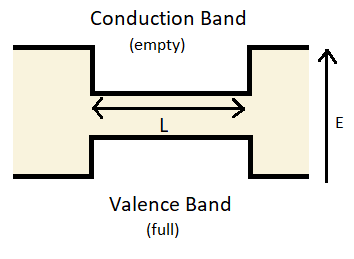

---
search:
  exclude: true
---

# Doping and devices

## Exercises

### Preliminary provocations

  1. Write down the law of mass action. Does the intrinsic carrier concentration depend on the Fermi energy?
  2. Write down the approximate charge balance condition for a doped semiconductor in the intrinsic regime.
  3. Write down the charge balance condition in case there are only donors and no acceptors
  4. Again considering only donors, compute the Fermi energy in the extrinsic regime
  5. Draw the band diagram of the PN diode. Suppose you want to send a current through the diode by a applying a voltage. On which side should you connect the positive-voltage terminal to get a large current?

### Exercise 1: Crossover between extrinsic and intrinsic regimes

  In the lecture we have identified the intrinsic and extrinsic regimes. Let us now work out what happens when the semiconductor is at the border between these two regimes, and the dopant concentration $|N_D - N_A|$ is comparable to the intrinsic one $n_i$.

  1. Write down the law of mass action and the charge balance condition for a doped semiconductor.

    Law of mass action:

    $$ n_e n_h = \frac{1}{2} \left(\frac{k_BT}{\pi\hbar^2}\right)^3
    (m_e^{\ast}m_h^{\ast})^{3/2}e^{-\beta E_{gap}}$$

    Charge balance condition:

    $$ n_e - n_h + n_D - n_A = N_D - N_A $$

  2. Solve this system of equations for $n_e$ and $n_h$ only assuming $E_G \gg k_B T$.

    Since $E_G \gg k_B T$, we can only use the law of mass action.
    But the question offers us another piece of information - we are around $|N_D-N_A| \approx n_i$.
    That means that we are near the transition between extrinsic and intrinsic regimes.
    In this regime we can neglect $n_D$ and $n_A$ in this exercise, just like in the lecture.
    Writing $n_e n_h = n_i^2$ and $n_e - n_h = N_D - N_A$ and solving these together, we obtain

    \begin{align}
    n_{e} = \frac{1}{2}(\sqrt{D^2+4n_i^2}+D),\\
    n_{h} = \frac{1}{2}(\sqrt{D^2+4n_i^2}-D)
    \end{align}

    where $D = N_D - N_A$.

    For $n_i \gg |N_D - N_A|$ we recover the intrinsic regime, while the opposite limit gives the extrinsic expressions.

  3. Verify that your solution reproduces intrinsic regime when $|N_D - N_A| ≪ n_i$ and the extrinsic regime when $|N_D - N_A| ≫ n_i$

    If $D \ll n_i$, then the doping is not important and results of intrinsic are
    reproduced.
    Contrarily, if $D \gg n_i$, it's mostly the doping that determines $n_e$ and $n_h$.
    The thermal factor becomes unimportant.
    Check both cases with lecture notes approximated solutions by doing a Taylor expansion.

### Exercise 2: Donor ionization

  Let us examine when the full donor ionization is a good assumption. For that we consider a doped semiconductor in the extrinsic regime.

  1. Assume that all dopants are ionized, determine the position of the Fermi level.

    If all the dopants are ionized ($n_D \approx 0$), the Fermi level is given by the expression for the extrinsic regime from the lecture.

  2. Write down the concentration of dopants that are not ionized.

    The desired fraction is

    $$
    n_D = \frac{N_D}{\exp[(E_D-E_F)/k_B T]+1}
    $$

  3. Determine at what donor concentration one cannot assume anymore that all donors are ionized in germanium at room temperature.

    Using $n_D \sim N_D$ we get

    $$
    (E_C - E_D)/k_B T \approx \log(N_C / (N_D - N_A)),
    $$

    For germanium at room temperature $(E_C - E_D)/k_B T \approx 1/3$ (as derived in the lecture), and therefore as long as $N_D - N_A \ll N_C \sim 1\%$, assuming that all donors are ionized is safe.

### Exercise 3: Performance of a diode

  Consider a pn-junction diode as follows

  

    </img>
  

??? info "Source"
    By Raffamaiden [CC BY-SA 3.0](https://creativecommons.org/licenses/by-sa/3.0)), [Link](https://commons.wikimedia.org/wiki/File:PN_diode_with_electrical_symbol.svg)

  The current flowing through a diode as a function of applied bias voltage is given by the Shockley diode equation:

  $$ I(V) = I_s(T)\left(e^{\frac{eV}{kT}}-1\right)$$

  where $I_s(T)$ is the saturation current.

  1. What is the significance of adding dopant atoms to an intrinsic semiconductor?
     Can two intrinsic semiconductors joined together make a diode?

    Intrinsic semiconductors have no impurities. Adding dopant atoms creates extra unbounded
    electrons/holes depending on the n/p dopant atom added. Impurity eigenstates appear and
    the $E_F$ level shifts (up/down for added donors/acceptors).

    To make a diode a p-n junction is needed (extrinsic semiconductors). Drawing a diagram is
    very helpful.

  2. Discuss which processes carry current in a diode under reverse bias.

    Under reverse bias only two processes carry out current: electrons that may be thermally
    excited into the conduction band (p-doped side) and holes that may be thermally
    excited into the valence band (n-doped side).

  3. Based on this, estimate how the saturation current $I_s$ depends on temperature.

    $$ I_s(T) \propto e^{-E_{gap}/k_BT}$$

### Exercise 4: Quantum well heterojunction in detail
  Consider a a quantum well formed from a layer of GaAs of thickness $L$, surrounded by layers of Al$_{x}$Ga$_{1−x}$As.

  {: .center}

??? info "Source"

    Vectorised by User:Sushant savla from the work by Gianderiu - [Quantum well.svg](https://commons.wikimedia.org/w/index.php?curid=73413676), [CC-BY-SA 3.0](https://creativecommons.org/licenses/by-sa/3.0 "Creative Commons Attribution-Share Alike 3.0").

  Assume that the band gap of the Al$_{x}$Ga$_{1−x}$As is substantially larger than that of GaAs.
  The electron effective mass in GaAs is 0.068 $m_{e}$, the hole effective mass is 0.45 $m_{e}$ with $m_{e}$ the mass of the electron.

  1. Sketch the band diagram of this quantum well.

    {: .center}

    * Include the energy bands here. You can find them at the book's section 18.2

  2. Write down the Schrödinger's equation for electrons and holes

    This a "particle in a box" problem.

    \begin{align}
    -\frac{\hbar^2}{2m_e^{\ast}} \nabla^2 \Psi_e &= (E_e-E_c)\Psi_e\\
    -\frac{\hbar^2}{2m_h^{\ast}} \nabla^2 \Psi_h &= (-E_h-E_v)\Psi_h
    \end{align}

    Here and below $E_h$ is the energy of a hole in the valence band.

  3. Find the energies of electron and holes in the quantum well as a function of $k_x, k_y$.

    \begin{align}
    E_e = E_c + \frac{\hbar^2}{2m_e^{\ast}} ((\frac{\pi n}{L})^2+k_x^2+k_y^2),\\
    -E_h = E_v - \frac{\hbar^2}{2m_h^{\ast}} ((\frac{\pi n}{L})^2+k_x^2+k_y^2)
    \end{align}

  4. Calculate the density of states of electron and holes in this quantum well.

    This is a 2D electron/hole gas, therefore the DOS per unit area expression is the same as in 2D parabolic dispersion:

    \begin{align}
    g_e = \frac{m_e^{\ast}}{\pi\hbar^2},\\
    g_h = \frac{m_h^{\ast}}{\pi\hbar^2}
    \end{align}

  5. If we want to design a quantum well with a bandgap 0.1 eV larger than that of bulk $GaAs$, what thickness $L$ do we need?

    $L$ can be found here using previous questions, by setting:

    $$
    E_e - E_h - E_c + E_v = 1 eV = \frac{\hbar^2}{2}(\frac{\pi n}{L}^2+k_x^2+k_y^2)
    (\frac{1}{m_e^{\ast}}+\frac{1}{m_h^{\ast}})
    $$

    By choosing the correct $n$, $k_x$ and $k_y$, $L$ can be found as $\approx 6.85$ nm

  6. Why is this structure more useful for making a laser than a normal pn-junction?

    For a laser, one wants to fix the emission wavelength to a certain value. With
    this setup, the band gap is "easy" to design (set by $L$, which is fixed).

  7. What would be the advantage of doping the Al$_{x}$Ga$_{1−x}$As compared to the $GaAs$ in this quantum well?

    If donor impurities are put outside of the well (on both sides, for example)
    the donated electrons can reduce their energies by falling into the well,
    but the ionized dopants remain behind. This gives an advantage because an
    extremely high mobility for electrons can be obtained within the quantum well
    (there are no ionized dopants in the well to scatter off of).
    This is called modulation doping.
