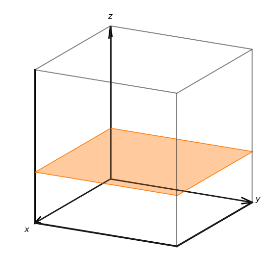
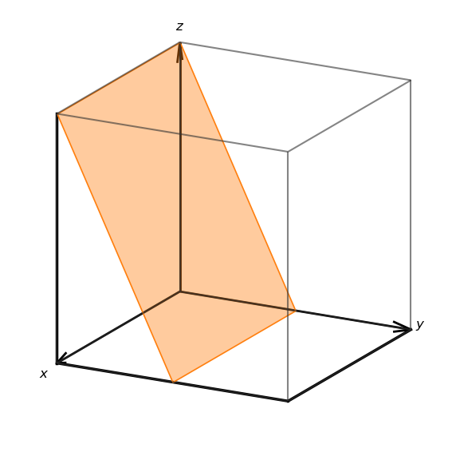
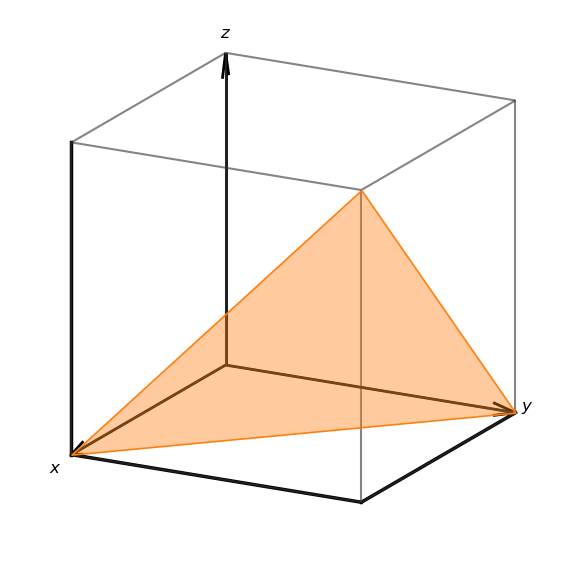
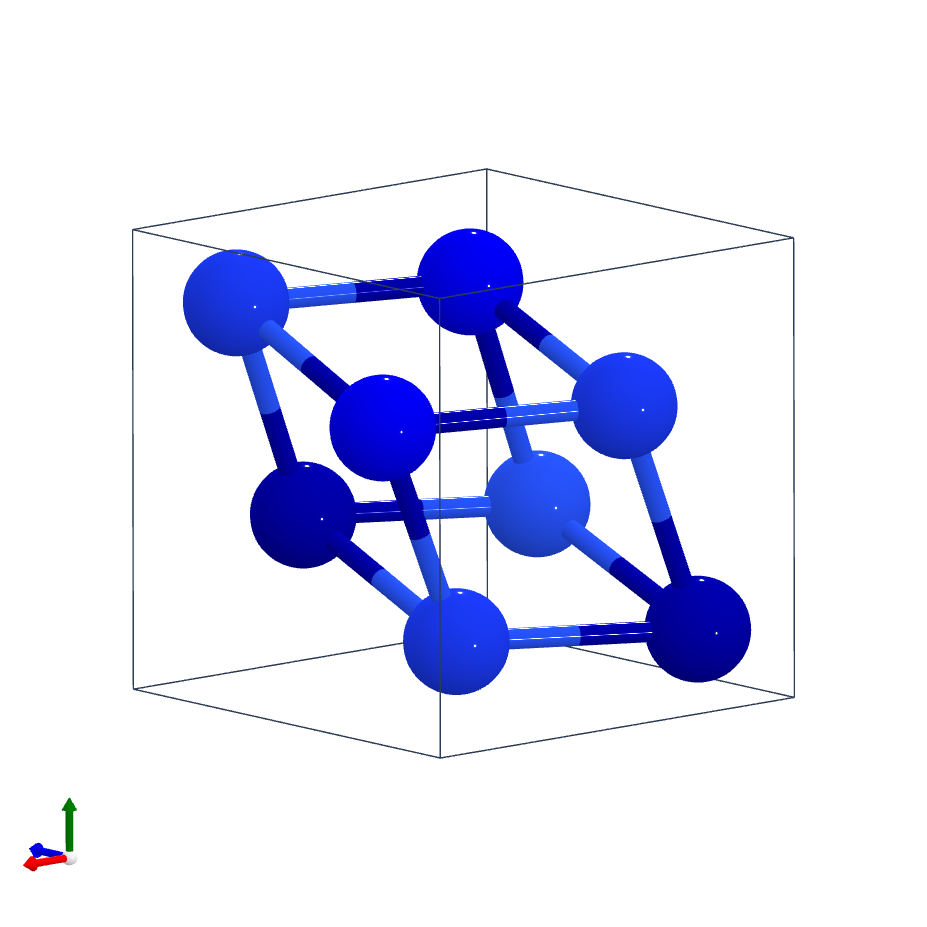
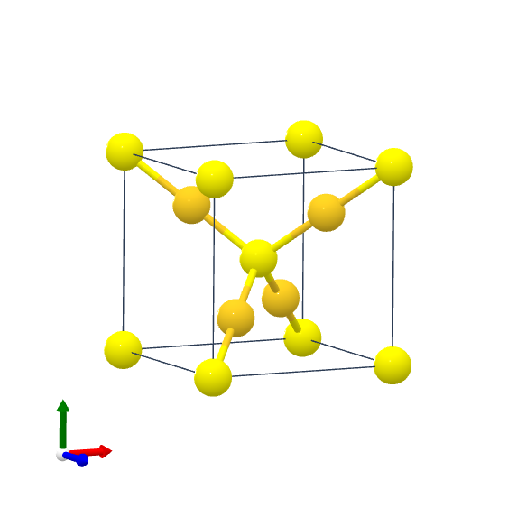
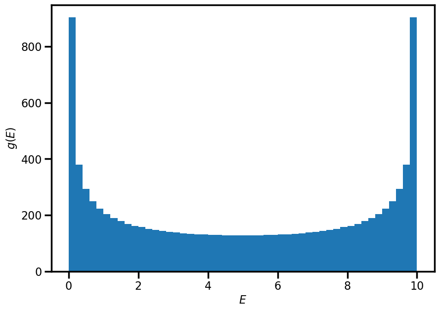
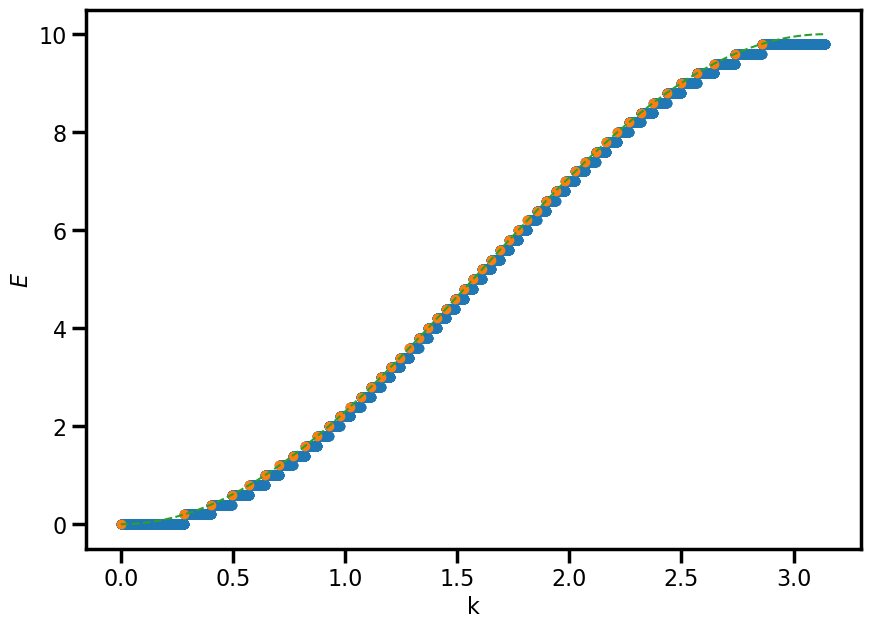
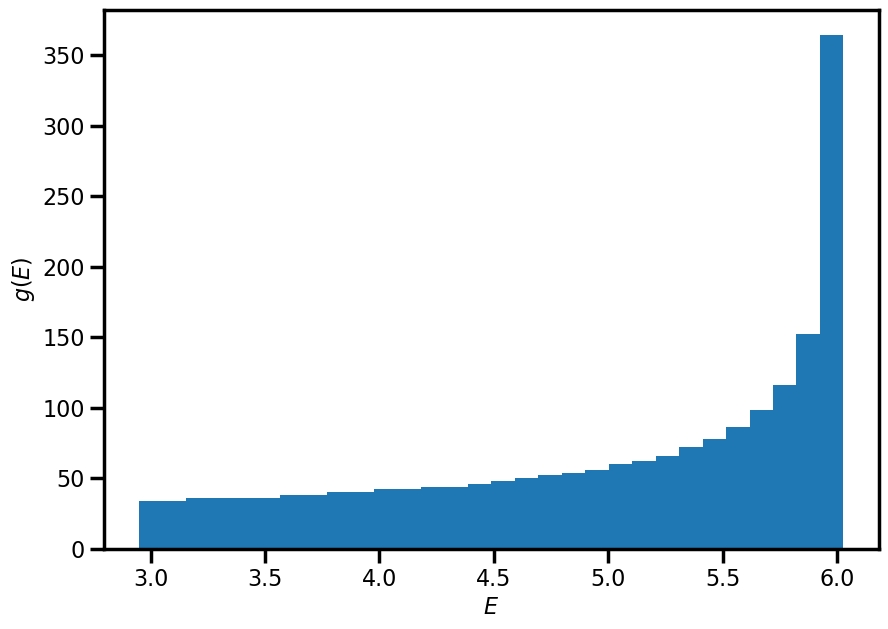
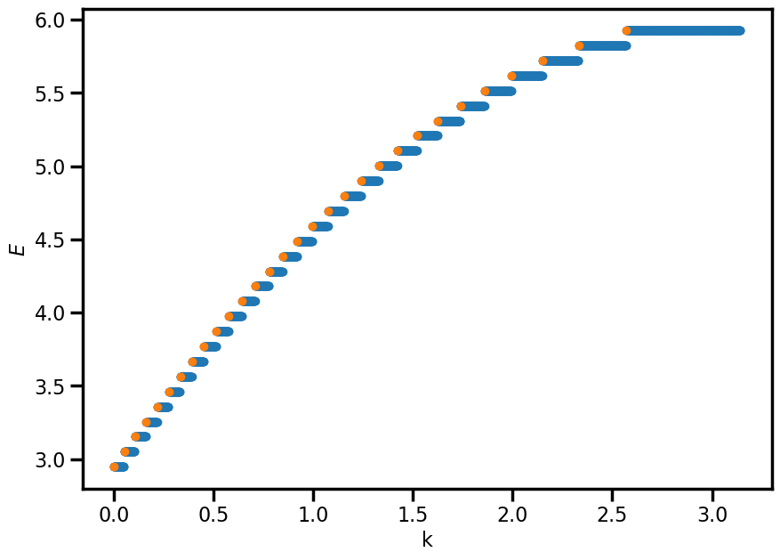

---
search:
  exclude: true
---

# Assignment 5: Complex 1D systems, crystals, and the reciprocal lattice

## Exercise 1 - Insert impurity

In class, we looked at the harmonic chain with all masses (atoms) identical. Here we shall look at some non-trivial modifications to this model.

!!! question ""

    **a.** What is the dispersion relationship for the 1D harmonic chain?

$$
    \omega=2\sqrt{\frac{\kappa}{m}}\left\rvert \sin\left(\frac{ka}{2}\right)\right\rvert
$$
---
We will now see what happens when we try to drive the harmonic chain at frequency $\omega>\omega_0\equiv 2\sqrt{\kappa/m}$.

!!! question ""

    **b.** Define the frequency ratio as $\Omega=\omega/\omega_0$. Show that
    $$
        ka = \pm2\arcsin\left(\Omega\right)
    $$

$$
    \Omega=\omega/\omega_0=\left\rvert\sin\left(\frac{ka}{2}\right)\right\rvert
$$
So we can invert this to get

$$
    ka = \pm2\arcsin\left(\Omega\right)
$$

!!! question ""

    **c.** What happens to $k$ for $\Omega>1?$ What is the physical significance of this?

For $|\Omega|>1$, this means that $k$ will be complex, with the real component of $\pi$. A complex wavenumber means that there will be absorption in the medium - in this case, the wave will decay over a length scale of $1/\Im\{z\}$

---

Now imagine a scenario where a single atom is different (an impurity) which is located at site $n=0$, with mass $m$ which is less than $M$, the mass of the other atoms.

!!! question ""

    **d.**This system will contain the normal travelling wave solutions, plus a mode localised to the impurity. Assuming a wave of the form

    $$
        \delta x_n = Ae^{i\omega t-q \rvert n \rvert a}
    $$

    where $q\in\mathbb{C}$, find the frequency of this impurity mode.

    **Hint 1**: the different parts of this question are connected; you may need to look at $\omega>\omega_0$

    **Hint 2**: Find expressions for $\delta x_n$ when $n\le0$ and $n\ge0$ with real unknowns only, and using the substitution $z=e^{qa}$ one should be able to solve for $qa$.

To wrap this together nicely, it is best to write solutions for $x_n$ for the cases where $n\ge0$ and $n\le0$ separately. From the previous parts of this question we have the expression for $0<\omega<\omega_0$

$$
    ka = \pm2\arcsin\left(\frac{\omega}{\omega_0}\right)
$$

and for $\omega>\omega_0$,

$$
    ka = \pi \pm iqa
$$

where $q\in\mathbb{R}$. We need to be careful with the sign for these solutions, specifically, insisting that $q\ge0$ we can identify that we must have the $+$ wave on the left and the $-$ wave on the right such that we get decay away from the impurity, so we have

\[
    \delta x_n =
    \begin{cases}
       Ae^{i \omega t-i\pi n +q a n} \quad n\le0 \\
      Ae^{i \omega t-i\pi n -q a n} \quad n\ge0
   \end{cases}
\]

It is worth noting that $q$ in the suggested solution

$$
\delta x_n = Ae^{i\omega t-q\rvert n \rvert a}
$$

is complex, and we know that the real part with be $\pi$ (as per the previous parts) so it is better written with $qa=\pi\pm iq^\prime a$ where $q^\prime \in \mathbb{R}$ so that our wave solutions will be those listed above (although with a $q^\prime$ rather than $q$).

Now we turn to our equations of motion: for $n\ne0$ we have

\[
    M\ddot{\delta x}_n = \kappa\left(\delta x_{n-1} + \delta x_{n+1} - 2\delta x_n \right)
\]

and

\[
    m\ddot{\delta x}_0 = \kappa\left(\delta x_{-1} + \delta x_1 - 2\delta x_0 \right)
\]

For the $n=0$ case:

\begin{align*}
     m\ddot{\delta x}_0 & = \kappa\left(\delta x_{-1} + \delta x_{+1} - 2\delta x_0 \right) \\
     \Rightarrow -m\omega^2 Ae^{i \omega t}&=\kappa \left( Ae^{i \omega t + i\pi(-1) +q a(-1)} + Ae^{i \omega t-i\pi (+1) -q a (+1)} -2Ae^{i \omega t}\right)\\
     \Rightarrow -m\omega^2 &= \kappa\left(e^{-i\pi} e^{-qa} + e^{-i\pi}e^{-q a} -2\right)\\
     &=-2\kappa\left(e^{-qa}+1\right)
\end{align*}

For the $n\ne0$ case, we know that the dispersion relation for the will satisfy

\[
    -M\omega^2 = 2\kappa\left(\cos(ka)-1\right)
\]

In case this is not obvious, this is equivalent to

\[
    \omega=2\sqrt{\frac{\kappa}{M}}\left\rvert \sin\left(\frac{ka}{2}\right)\right\rvert
\]

We must look at either $n>0$ or $n<0$ (they give the same result) so let's look at $n>0 \Rightarrow qa = \pi-iqa$:

\begin{align*}
    -M\omega^2 &= 2\kappa\left(\cos(\pi-iqa) -1 \right) \\
    & = 2\kappa\left(-\cos(iqa) - 1\right)\\
    & = -2\kappa\left(\cosh(qa)+1\right)
\end{align*}

meaning that the mode must satisfy

\begin{align*}
    \omega^2&=\frac{2\kappa}{M}\left(\cosh(qa)+1\right)=\frac{2\kappa}{m}\left(e^{-qa}+1\right) \\
    &\Rightarrow m\left(\cosh(qa)+1\right) = M\left(e^{-qa}+1\right)
\end{align*}

We have roughly $\cosh(ax)$ and $e^{-ax}$, and are looking for an intersection of these curves, but only for $x\ge0$ - that is, $q\ge0$ - which can happen but only when $m\le M$. To find this, we write $z=e^{qa}$ which gives

\begin{align*}
    \frac{m}{M}\left(\frac{1}{2}\left(z+z^{-1}\right)+1\right) = z^{-1}+1\\
\end{align*}

This is a quadratic in z, which has solutions (courtesy of [WolframAlpha](https://www.wolframalpha.com/))

$$
    z=-1, \frac{2M}{m} - 1
$$

meaning that

$$
    qa=\log\left(\frac{2M}{m}-1\right)
$$

since $q\in\mathbb{R}$, and thus the frequency of the mode is

$$
    \omega^2 = -\frac{2\kappa}{m}\left(\cos(\pi+iqa)-1\right)
$$

which when $M<m$ will give a real frequency, which is _greater_ than $\frac{2\kappa}{m}$

!!! question ""

    **e.** Explain physically what this localised mode is, and provide an explanation for why it forms.

The previous solution has a few hints at this: the result is only sensible when the mass of the impurity is less than the mass of the particles in the chain. When this is the case, the chain will have some maximum oscillation frequency, but with a lighter impurity, this maximum frequency will be higher. But whilst the impurity can occupy a mode with $\Omega>1$, the environment cannot, therefore it will be an evanescent wave in the chain.

## Exercise 2 - The triatomic chain

We have looked in detail at the monatomic chain and the diatomic chain. Here, we shall look at the _triatomic_ chain.

!!! question ""

    **a.**  What is the acoustic branch, and what is an optical branch?

An acoustic branch is a dispersion relation which has dispersion of the form $\omega = v_s \rvert k \rvert$ for low $k$, which has the physical interpretation that neighbouring atoms will be propagating "in phase" (only true for $k=0$, regions of atoms nearly in phase). The optical branch has the characteristic that $\omega \ne0$ for $k=0$, meaning that it will also intersect the dispersion relation of photons.

!!! question ""

    **b.** How many branches would one expect for the triatomic chain? What atomic motion between neighbouring atoms might one expect in the different branches?

3 atoms per unit cell $\Rightarrow$ 1 acoustic branch and two optical branches

!!! question ""

    **c.** Write down the equations of motion for the most general case of a triatomic chain, that is, 3 atoms with distinct masses $m_{1,2,3}$ and distinct spring constants $\kappa_{1,2,3}$ between the masses, where we denote the positions of these three atoms as $x, y, z$

\begin{align*}
    m_1 \ddot{\delta x}_n &= -\kappa_3 (\delta x_n - \delta z_{n-1}) - \kappa_1 (\delta x_n - \delta y_n) \\
    m_2 \ddot{\delta y}_n &= -\kappa_1 (\delta y_n - \delta x_n) - \kappa_2 (\delta y_n - \delta z_n) \\
    m_3 \ddot{\delta z}_n &= -\kappa_2 (\delta z_n - \delta y_n) - \kappa_3 (\delta z_n - \delta x_{n+1})
\end{align*}

!!! question ""

    **d.** Seeking the normal modes of the system, obtain an eigenvalue equation for $(\delta x_n, \delta y_n, \delta z_n)$

$$
0 = \begin{vmatrix}
    \kappa_3 + \kappa_1 - m_1 \omega^2 & \kappa_1                          & \kappa_3 e^{-ika} \\
    \kappa_1                          & \kappa_1 + \kappa_2 - m_2 \omega^2 & \kappa_2         \\
    \kappa_3 e^{ika}                   & \kappa_2                          & \kappa_2 + \kappa_3 - m_3 \omega^2
    \end{vmatrix}
$$

!!! question ""

    **e.** Obtain an expression for the characteristic polynomial that one would be required to find the branches, and use this show that $k=0$, there are the number of expected branches.

    **NOTE**: Feel free to use computational tools to help turn any ugly determinants into polynomials, just ensure to state what you used and how you used it.

I used `Mathematica` to obtain

\begin{align*}
    0 = & m_1 m_2 m_3 \omega^6  \\
  & - \left[ \kappa_1 (m_1 + m_2) m_3 + \kappa_3 m_2 (m_1 + m_3) + \kappa_2 m_1 (m_2 + m_3) \right] \omega^4 \\
  & + \left[ (\kappa_2 \kappa_3 + \kappa_1 \kappa_2 + \kappa_3 \kappa_1)(m_1 + m_2 + m_3) \right] \omega^2 \\
  & - \left[ \kappa_1 \kappa_2 \kappa_3 (2 - 2 \cos(ka)) \right]
\end{align*}

which in the case of $k \rightarrow 0$ will remove the constant term, and thus will have a $\omega = 0$ solution (i.e. an acoustic branch) as expected.

## Exercise 3 - Crystal palace

Consider the following two-dimensional diatomic crystal:
{.center width="400" }

!!! question ""

    **a.**i) Sketch the Wigner-Seitz unit cell and two other possible primitive unit cells of the crystal

{.center width="400" }

!!! question ""

    **a.**ii) If the distance between the filled circles is $a=2.8\mathrm{\unicode{x212B}}$, what is the area of the primitive unit cell? How would this area change if all the empty circles and the filled circles were identical?

The area of the primitive unit cell is $A = a^2$. If the filled and empty circles are identical particle, the nearest neighbour distance becomes $a^* = \frac{a}{\sqrt{2}}$ and thus the area $A^* = {a^*}^2 = \frac{a^2}{2} = \frac{A}{2}$.

!!! question ""

    **a.**iii) Write down one set of primitive lattice vectors and the basis for this crystal. What happens to the number of elements in the basis if all empty and filled circles were identical?

One set of primitive lattice vectors is

\[
  \mathbf{a_1} = a \hat{\mathbf{x}}, \quad \mathbf{a_2} = a \hat{\mathbf{y}}.
\]

With respect to the primitive lattice vectors, the basis is

\[
  \huge \bullet ~ \normalsize[0,0], \quad \bigcirc ~ [\frac{1}{2},\frac{1}{2}]
\]

If all atoms were identical, then the basis only has one element (and consequently the PLVs above would cease to be PLVs)

!!! question ""

    **a.**iv) Imagine expanding the lattice into the perpendicular direction $z$. We can define a new three-dimensional crystal by considering a periodic structure in the $z$ direction, where the filled circles have been displaced by $\frac{a}{2}$ in both the $x$ and $y$ direction from the empty circles. The figure below shows the new arrangement of the atoms.

    {.center}

    What lattice do we obtain? Write down the basis of the three-dimensional crystal.

The lattice is a cubic lattice, and the basis of the crystal is

\[
  \huge \bullet \normalsize ~ [0,0,0], \quad \bigcirc ~ \left[\frac{1}{2},\frac{1}{2},\frac{1}{2}\right].
\]

An example of such a material is Caesium Chloride (CsCl)

---
The image below shows the three dimensional structure of zincblende (ZnS) (sulphur atoms are yellow, zinc atoms are grey).


!!! question ""

    **b.**i) How many atoms are in the unit cell?

Corner atoms $8 \times 1/8 $ + face atoms ($6 \times 1/2$) + interior atoms ($4 \times 1$) = $1 + 3 + 4 = 8$

!!! question ""

    **b.**ii) Draw the plan view of the unit cell

{.center width="400" }

!!! question ""

    **b.**iii) Identify the lattice type of zincblende

The lattice type is Face-centred cubic (FCC)

!!! question ""

    **b.**iv) Describe the basis for zincblende

The basis can be described as S at [0,0,0] and Zn at [1/4, 1/4, 1/4]

!!! question ""

    **b.**v) Given the unit cell length $a=5.41\mathrm{\unicode{x212B}}$, calculate the nearest-neighbour Zn-Zn, Zn-S, and S-S distances

This is just geometry: Zn-Zn is $a/\sqrt{2} = 3.83\mathrm{\unicode{x212B}}$, Zn-S is $a\sqrt{1/4^2 + 1/4^2 + 1/4^2} = 2.34 \mathrm{\unicode{x212B}}$, and S-S is $a/\sqrt{2} = 3.83\mathrm{\unicode{x212B}}$.

## Exercise 4 - Reciprocity

Following the normal conventions, let us denote $\mathbf{a}_i$ and $\mathbf{b}_i$ as the real-space and reciprocal space lattice vectors.

!!! question ""

    **a.**i) A construction of lattice vectors can be achieved using the relation
    \[
    \mathbf{b}_i = 2\pi \frac{\mathbf{a}_j \times \mathbf{a}_k}{\mathbf{a}_1 \cdot (\mathbf{a}_2 \times \mathbf{a}_3)}
    \]
    Explicitly compute $\mathbf{a}_1 \cdot \mathbf{b}_1$, $\mathbf{a}_2 \cdot \mathbf{b}_1$, and $\mathbf{a}_3 \cdot \mathbf{b}_1$. Do these computations accord with the definition of the reciprocal lattice?

The computation of these vectors is aided by knowledge of [properties of the scalar triple product](https://en.wikipedia.org/wiki/Triple_product#Scalar_triple_product). In calculating the product:

$$
\mathbf{a}_i \cdot \mathbf{b}_1 = 2\pi \frac{\mathbf{a}_i \cdot (\mathbf{a}_2 \times \mathbf{a}_3)}{\mathbf{a}_1 \cdot (\mathbf{a}_2 \times \mathbf{a}_3)}
$$

it should be immediately obvious that $\mathbf{a}_2 \times \mathbf{a}_3$ is orthogonal to both $\mathbf{a}_2$ and $\mathbf{a}_3$, so the dot product between $\mathbf{a}_2$ and $\mathbf{a}_3$ will be zero. In the case of $\mathbf{a}_1$, we then have identical vector products on both numerator and denominator and therefore the product evaluates to $2\pi$.

The construction of the reciprocal lattice is baser around the identity

$$
e^{i\mathbf{G}\cdot\mathbf{R}} = 1
$$

for any lattice point $\mathbf{R}$ and any reciprocal lattice point $\mathbf{G}$. That relation only holds when

$$
\mathbf{a}_i \cdot \mathbf{b}_j = 2\pi \delta_{ij}
$$

and hence our relations above are looking good.

!!! question ""

    **a.**ii) The volume of a primitive unit cell with lattice vectors $\mathbf{a}_i$ is given by $V = \left|\mathbf{a}_1 \cdot (\mathbf{a}_2 \times \mathbf{a}_3) \right|$. Find the volume of the corresponding primitive unit cell in reciprocal space.

The volume in reciprocal space $V'$ should be computed using the same method as provided:

$$
\begin{align}
V' & = \left|\mathbf{b}_1 \cdot (\mathbf{b}_2 \times \mathbf{b}_3) \right| \\
& = 2\pi \left| \frac{(\mathbf{a}_2 \times \mathbf{a}_3)}{\mathbf{a}_1 \cdot (\mathbf{a}_2 \times \mathbf{a}_3)} \cdot (\mathbf{b}_2 \times \mathbf{b}_3) \right| \\
& = \frac{2\pi}{V}\left| (\mathbf{a}_2 \times \mathbf{a}_3) \cdot (\mathbf{b}_2 \times \mathbf{b}_3) \right| \\
& = \frac{2\pi}{V}\left| (\mathbf{a}_2 \cdot \mathbf{b}_2)(\mathbf{a}_3 \cdot  \mathbf{b}_3) - ( \mathbf{a}_2 \cdot \mathbf{b}_3)( \mathbf{a}_3 \cdot \mathbf{b}_2) \right| \\
& = \frac{(2\pi)^3}{V}
\end{align}
$$

!!! question ""

    **a.**iii) Show that the general direction $[hkl]$ in a cubic crystal is normal to the planes with Miller indices $(hkl)$.

Consider a (real-space) lattice with basis vectors $\mathbf{a}$, $\mathbf{b}$, and $\mathbf{c}$ which are assumed orthogonal (cubic crystal). Let the lengths of these vectors be $a$, $b$, and $c$ respectively. The plane $(hkl)$ will have intercepts with the axes at (a/h, 0, 0), (0, b/k, 0), (0, 0, c/l), and from these 3 points, one can construct a vector normal to the plane (which defines the plane) by taking the cross products between any two vectors between the points above. For example,     consider

$$
\begin{align}
\mathbf{n} & = (\mathbf{a}/h - \mathbf{b}/k) \times (\mathbf{a}/h - \mathbf{c}/k) \\
& = \frac{abc}{hkl} \left( \frac{h}{a^2}\mathbf{a} + \frac{k}{b^2}\mathbf{b} + \frac{l}{c^2}\mathbf{c} \right)
\end{align}
$$

and this is only parallel to the vector $[hkl]$ in the case of $a = b = c$.

!!! question ""

    **a.**iv) Is the above statement true for an orthorhombic crystal? Justify your response.

No, it is not true, see the question above!

!!! question ""

    **a.**v) Show that the distance between two adjacent Miller planes $(hkl)$ of any lattice is $d=2\pi/|\mathbf{G}_{\textrm{min}}|$, where $\mathbf{G}_{\textrm{min}}$ is the shortest reciprocal lattice vector perpendicular to these Miller planes.

The unit vector normal to the plane can be computed via

$$
\hat{\mathbf{n}} = \frac{\mathbf{G}}{|\mathbf{G}|}.
$$

Let us consider a very simple case in which we have the miller planes $(h00)$. For lattice planes, there is always a plane intersecting the zero lattice point $(0,0,0)$. As such, the distance from this plane to the closest next one is given by

$$
d = \hat{\mathbf{n}} \cdot \frac{\mathbf{a_1}}{h} = \frac{2\pi}{|\mathbf{G}|}
$$

!!! question ""

    **a.**vi) Find the family of Miller planes of the BCC lattice that has the highest density of lattice points. It may of useful to think about the density of lattice points per unit area on a Miller plane which is given by $\rho=d/V$.

Since $\rho=d/V$, to maximise $\rho$ me must either must maximize $d$ or minimise $V$, the latter of which is fixed. Therefore, to maximise $d$, we minimize must $|\mathbf{G}|$ and thus the smallest possible reciprocal lattice vectors are the {110} family of planes.

!!! question ""

    **b.** What are the Miller indices for the following planes? Assume that the cube that is shown has sides of length $a$.

    { width="150" style="margin-left: 10%"}
    {width="150" style="margin-left: 5%"}
    {width="150" style="margin-left: 5%"}

The Miller indices for the planes are $(hkl) = (003), (021), (11\bar{1})$.

---

Consider the structure of Cobalt monosilicide, shown below.

{.center width="400" }

The basis for this structure is given by

\begin{align*}
    \mathrm{Co}: [0.854, 0.646, 0.354], [0.354, 0.854, 0.646], [0.646, 0.354, 0.854], [0.646, 0.854, 0.354] \\
    \mathrm{Si}: [0.157, 0.343, 0.657], [0.657, 0.157, 0.343], [0.343, 0.657, 0.157], [0.343, 0.157, 0.657]
\end{align*}


!!! question ""

    **c.**i) What is the lattice for this structure?

Cubic

!!! question ""

    **c.**ii) How many atoms are in the unit cell?

8

!!! question ""

    **c.**iii) List the first 5 Miller indices (where order is determined by $N=h^2+k^2+l^2$) which constitute families of lattice planes for CoSi

$(110),~(111),~(200),~(210)$, and $(211)$

---

Consider the structure of gold sulphide

{.center width="400" }

The conventional unit cell is

\begin{align*}
    \mathrm{S}: & [0, 0, 0],~[1/2, 1/2, 1/2] \\
    \mathrm{Au}: & [1/4, 1/4, 1/4], ~[1/4, 3/4, 3/4], ~[3/4, 1/4, 3/4], ~[3/4,3/4,1/4]
\end{align*}

!!! question ""

    **d.**i) Calculate the structure factor $S(hkl)$ for $\mathrm{Au_2 S}$

The structure factor is

\begin{align*}
    S(h k l)= & f_{\mathrm{S}}\left(1+e^{i \pi(h+k+l)}\right) \\
    & +f_{\mathrm{A u}}\left[e^{i \frac{\pi}{2}(h+k+l)}+e^{i \frac{\pi}{2}(h+3 k+3 l)}+e^{i \frac{\pi}{2}(3 h+k+3 l)}+e^{i \frac{\pi}{2}(3 h+3 k+l)}\right]
\end{align*}

and we can simplify the final term to

$$
    e^{i \frac{\pi}{2}(h+k+l)}\left[1+e^{i \pi(k+l)}+e^{i \pi(h+l)}+e^{i \pi(k+l)}\right]
$$

!!! question ""

    **d.**ii) Use the above result to identify the sub-lattice structure for both the gold and sulphur atoms

The coefficient of $f_{\mathrm{S}}$ will vanish unless $h+k+l$ is even, which is the selection rule for a BCC lattice. In the same way, the coefficient of $f_{\mathrm{Au}}$ will vanish unless $h, k, l$ are all even or all odd, which tells us that the Au form an FCC sub-lattice.

!!! question ""

    **d.**iii) Explain how the above results could help us to determine the scattering form factors $f_{\mathrm{S}}$ and $f_{\mathrm{Au}}$

Given the structure is cubic with a basis, all $(hkl)$ are allowed, but certain peaks will contain information only about one scattering form factor due to the sublattice construction: for example, the (110) peak will depend only on $f_{\mathrm{S}}$, whereas the (111) peak will depend only on $f_{\mathrm{Au}}$.

## Exercise 5 - Chained to bonds

In class, we looked at the energy eigenvalues of the so-called "tight-binding" model using the LCAO method. We are going to explore this territory a bit further. The first goal is going to be moving from the density of states to an energy band diagram. For these questions, assume that the hopping strength $t$ is half the *on-site* energy of the atom.

!!! question ""

    **a.** By modelling the tight-binding chain as $N$ identical atoms which couple only to their nearest neighbours, computationally produce a density of states plot by constructing the Hamiltonian, solving for the energy eigenvalues, and then producing a histogram of the energy eigenvalues.

``` py title="Plotting the density of states"
    N= 10000
    epsilon = 5
    t = 2.5

    hopping = np.eye(N, k=1)
    hopping += hopping.T

    H = epsilon * np.eye(N) - t * hopping
    eigs = np.linalg.eigvalsh(H)

    counts, bins, bars = plt.hist(eigs, bins = 50)

    plt.xlabel(r"$E$")
    plt.ylabel(r"$g(E)$")
```



!!! question ""

    **b.** Now we want to move from this density of states plot to an energy band diagram. Assuming that the band is symmetric about $k=0$, use your histogram to make a plot of the energy band. For large $N$, check that this plot agrees with the expected result for an infinite chain of tight-binding atoms.

``` py title="Energy band reconstruction"
a = 1
L = a * N
k_sep = 2*pi/L

k = np.linspace(0, pi/a, N)
energies = np.concat([np.repeat(bins[i],counts[i]) for i in range(len(bins)-1)])

k_min, k_max = [0, 0]
k_downsampled = []
e_downsampled = []

for i in counts:
    k_max += int(i)
    k_sampled = k[k_min:k_max].min()
    e_sampled = energies[k_min:k_max].mean()
    k_downsampled.append(k_sampled)
    e_downsampled.append(e_sampled)
    k_min += int(i)

plt.scatter(k, energies)
plt.scatter(k_downsampled, e_downsampled)
plt.plot(k, epsilon - 2*t * np.cos(k*a), linestyle = '--', c='C2')

plt.xlabel(r"k")
plt.ylabel(r"$E$")
```



!!! question ""

    **c.** Now we shall repeat the above exercise for a system for which we do not know how the band structure should look. Imagine we have a special tight-binding chain, whereby electrons **cannot** hop between neighbouring atoms, but can hop to atoms which are an *odd number* of atoms away with a strength of $1/n$ ($n$ is the difference between atomic sites), and to atoms which are an *even number* of atoms away with a strength of $1/n^2$. Produce a plot of the density of states for this system and the associated energy band, and comment whether this band structure is what you might expect for such a system.


Basically, the only thing to do is to change how one constructs the hopping component of the matix, and this can be done many ways, but my version is as follows:

``` py
hopping = 0*np.eye(N)
for n in range(N):
    if (n == 0) or (n == 1):
        pass
    elif (n%2 != 0):
        h = 1/n * np.eye(N, k=n)
    else:
        h = 1/n**2 * np.eye(N, k=n)

        hopping += h + h.T
```     

and then one just needs to repeat the steps from the above questions with the new Hamiltonian.



