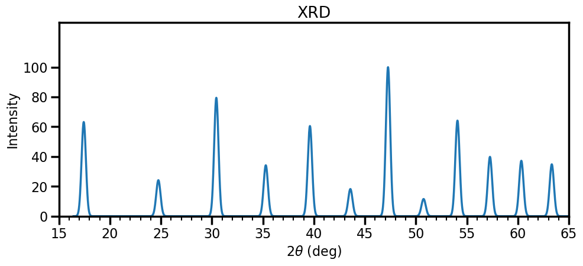
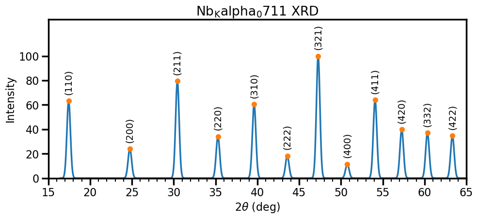
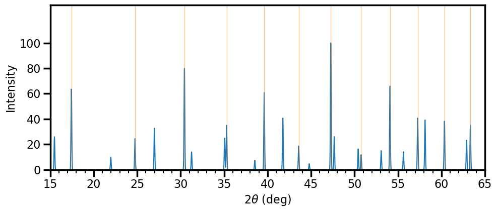
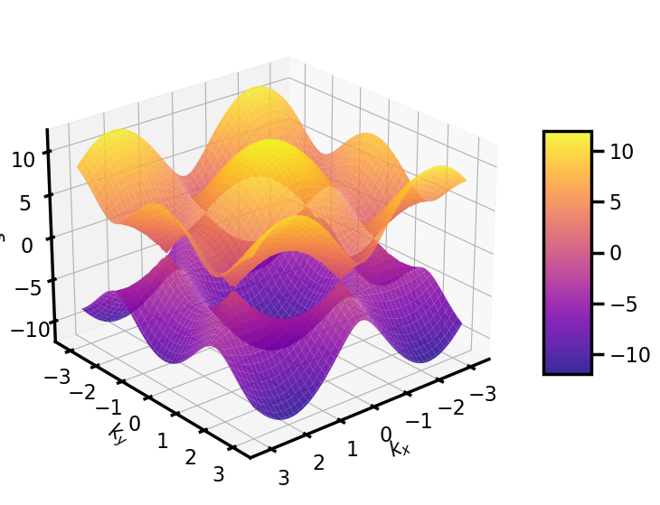
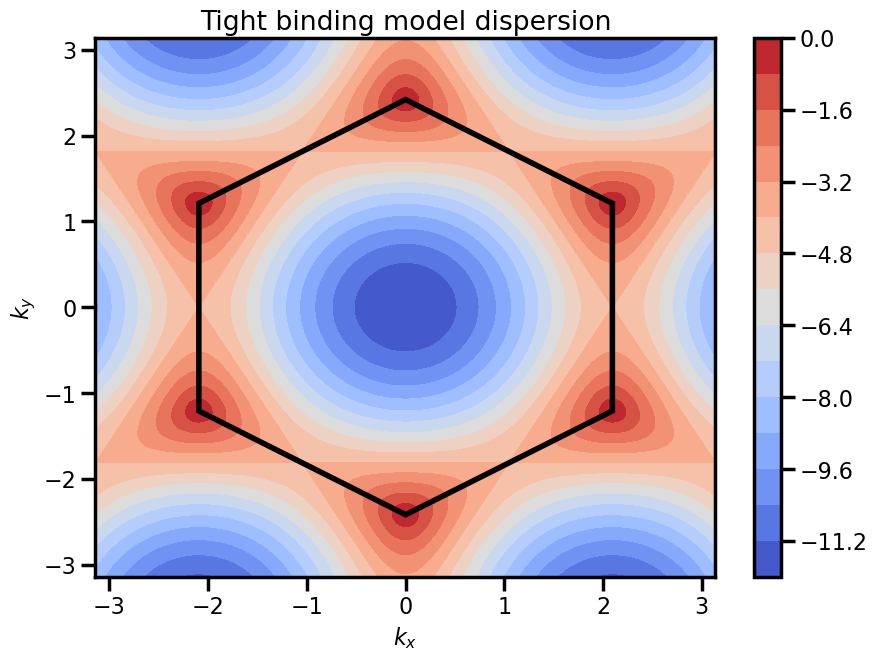

---
search:
  exclude: true
---

# Assignment 6: Scattering, bands, and semiconductors

## Exercise 1 - Neutron Scattering

In this question we shall look at the classic experiment for which Clifford Shull and Bertram Brockhouse won the 1994 Nobel Prize in physics. Notably Clifford Shull was motivated by finding the positions of hydrogen atoms in solids. An excellent test sample is sodium hydride (NaH).

!!! question ""

    **a.** Explain why X-ray scattering might have trouble probing the structure of such a sample.

X-rays scatter with an intensity $I\propto|S(\mathbf{G})|^2$ and the structure factor is related to the X-ray scattering form factor, which scales as $Z$, so seeing Hydrogen is hard!

---

Due to the difficulty in observing X-ray scattering from NaH and similar materials, along with the birth of neutron scattering with the advent of nuclear reactors, it was postulated that the scattering of neutrons could probe structures with hydrogen. Neutron scattering is essentially identical to X-ray scattering, except with the scattering X-ray scattering form factor $f(\mathbf{G})$ replaced by the *neutron scattering length*, $b$. Delightfully, this scattering length is independent of $\mathbf{G}$; however, there are no general trends for estimating the value of $b$ for different materials, they must be retrieved from tabulated experimental determinations.

It turns out X-ray diffraction was able to determine that the lattice structure of NaH (an FCC lattice) but not the basis. The H atoms were thought to be displaced from the Na atoms by either $[1/4, 1/4, 1/4]$ or $[1/2, 1/2, 1/2]$, forming either a zincblende or rock salt (NaCl) structure.

!!! question ""

    **b.** Explain physically why the scattered intensity depends on the structure factor for the lattice, the basis, and the multiplicity of a given set of Miller indices.

A periodic structure is comprised of a lattice and a basis (even it this is just a trivial basis, i.e. a single atom) so recall what this means: there are lattice points throughout space, and we have our motif (our basis) repeated at each lattice point. It should stand to reason that when we look at the scattered intensity, which directly tells us about the existence of structure over some length scale in our sample (the spatial frequency, $2\pi/a$), it must first and foremost be tied to the lattice - we could remove our motif, and the lattice structure would still be there, thus whatever motif we put on can only use this underlying lattice structure as a starting point. From here, it should be clear that the spacing of atoms within the unit cell should matter to determining the scattered waves - the spacing of atoms - which diffraction gives us direct access to - will obviously change as the atomic positions change. The multiplicity appears (in powder diffraction) as this quantifies how many different orientations a specific lattice spacing will have within a given structure.

!!! question ""

    **c.** Assuming a rock salt structure for NaH, write down the structure factor $S(hkl)$

    **HINT**: Part **c.** of this question is relevant. Also, looking at part d., don't feel that you must expand all products of sums.

The rock salt structure has 8 atoms in the unit cell (as compared with 4 for an FCC structure) so we are going to have many terms in our structure factor. The structure factor for the FCC lattice, with lattice points $\mathbf{R}_\alpha$ is given by

\begin{align*}
   S^{lattice}(\mathbf{G}) & = \sum_\alpha e^{i\mathbf{G\cdot \mathbf{R}_\alpha}} \\
   & = 1+e^{i\pi(h+k)}+e^{i\pi(h+l)}+e^{i\pi(k+l)}
\end{align*}

as lattice vectors are $[1/2, 1/2, 0], [1/2, 0, 1/2],~\mathrm{and}~[0, 1/2, 1/2]$.\\

The structure factor for the basis with atoms located at sites $\mathbf{r}_j$ is

\begin{align*}
   S^{basis}(\mathbf{G}) & = \sum_j e^{i\mathbf{G\cdot \mathbf{r}_j}}\,b_j \\
   & = b_\mathrm{Na} + b_\mathrm{H} e^{i\pi(h+k+l)}
\end{align*}

where for rock salt, we have the basis Na at $[0,0,0]$ and H at $[1/2, 1/2, 1/2]$. This means the total structure factor is

$$
S(hkl) = \left(1+e^{i\pi(h+k)}+e^{i\pi(h+l)}+e^{i\pi(k+l)}\right) \left(b_\mathrm{Na} + b_\mathrm{H} e^{i\pi(h+k+l)}\right)
$$

!!! question ""

    **d.** Assuming a zincblende structure for NaH, write down the structure factor $S(hkl)$

    **HINT**: as for part **c.**

Once again, zincblende has 8 atoms in the unit cell (as compared with 4 for an FCC structure) so we are going to have many terms in our structure factor. We have the structure factor for the lattice from the question above, and so the structure factor for the basis with atoms located at sites $\mathbf{r}_j$ is

\begin{align*}
   S^{basis}(\mathbf{G}) & = \sum_j e^{i\mathbf{G\cdot \mathbf{r}_j}}\,b_j \\
   & = b_\mathrm{Na} + b_\mathrm{H} e^{i\pi(h/2+k/2+l/2)}
\end{align*}

and thus the total structure factor is

$$
S(hkl) = \left(1+e^{i\pi(h+k)}+e^{i\pi(h+l)}+e^{i\pi(k+l)}\right)\left( b_\mathrm{Na} + b_\mathrm{H} e^{i\pi(h/2+k/2+l/2)} \right)
$$

!!! question ""

    **e.** The intensity of the Bragg peak for $(111)$ was measured to be much larger than the Bragg peak for $(200)$. Given this information, determine the location of hydrogen within the unit cell.

    **HINT**: The neutron scattering length for sodium is $b_{\mathrm{Na}}=0.363\times10^{-5}~\mathrm{nm}$ and for hydrogen is $b_{\mathrm{H}}=-0.374\times10^{-5}~\mathrm{nm}$

We have that

\begin{align*}
    S_{rock~salt}(111) & = \left(1+e^{i2\pi}+e^{i2\pi}+e^{i2\pi}\right)\left( b_\mathrm{Na} + b_\mathrm{H} e^{i3\pi} \right) \\
    S_{rock~salt}(200) & = \left(1+e^{i2\pi}+e^{i2\pi}\right)\left( b_\mathrm{Na} + b_\mathrm{H} e^{i2\pi} \right) \\
    S_{zincblende}(111) & = \left(1+e^{i2\pi}+e^{i2\pi}+e^{i2\pi}\right)\left( b_\mathrm{Na} + b_\mathrm{H} e^{i\pi(3/2)} \right) \\
    S_{zincblende}(200) & = \left(1+e^{i2\pi}+e^{i2\pi}\right)\left( b_\mathrm{Na} + b_\mathrm{H} e^{i\pi} \right)
\end{align*}

Now to find the scattered intensity, we need to compute the modulus squared of these values, and multiply by the multiplicity.

\begin{align*}
    S_{rock~salt}(111) & = 4\left( b_\mathrm{Na} - b_\mathrm{H} \right) \Rightarrow \rvert S_{rock~salt}(111)\rvert^2=16\left( b_\mathrm{Na} - b_\mathrm{H} \right)^2 \\
    S_{rock~salt}(200) & = 3\left( b_\mathrm{Na} + b_\mathrm{H} \right) \Rightarrow \rvert S_{rock~salt}(200)\rvert^2=9\left( b_\mathrm{Na} + b_\mathrm{H} \right)^2\\
    S_{zincblende}(111) & = 4\left( b_\mathrm{Na} - ib_\mathrm{H}\right) \Rightarrow \rvert S_{zincblende}(111)\rvert^2=16\left( b_\mathrm{Na}^2 + b_\mathrm{H}^2 \right)\\
    S_{zincblende}(200) & = 3\left( b_\mathrm{Na} - b_\mathrm{H} \right) \Rightarrow \rvert S_{zincblende}(200)\rvert^2=9\left( b_\mathrm{Na} - b_\mathrm{H} \right)^2\\
\end{align*}

The multiplicities for (111) and and (200) are 8 and 6 respectively, so the ratio of peak intensities is

$$
\frac{I_{(111)}}{I_{(200)}} = \frac{16\left( b_\mathrm{Na} - b_\mathrm{H} \right)^2}{9\left( b_\mathrm{Na} + b_\mathrm{H} \right)^2}\frac{8}{6}\approx10^4
$$

for rock salt and

$$
\frac{I_{(111)}}{I_{(200)}} = \frac{16\left( b_\mathrm{Na}^2 + b_\mathrm{H}^2 \right)}{9\left( b_\mathrm{Na} - b_\mathrm{H} \right)^2}\frac{8}{6}\approx1
$$

for zincblende. Given the peak ratio was measured to be large, this means that the structure must be rock salt.

## Exercise 2 - (Diffr)action stations

 A powder diffraction experiment was undertaken using X-rays of sample with unknown structure. An X-ray tube with a Molybdenum target was used to produce the radiation, which has characteristic emissions of $E = 17.438 ~\mathrm{keV}$ and $19.618~\mathrm{keV}$. The $17~\mathrm{keV}$ emission is much more intense than the $19~\mathrm{keV}$ emission. The diffraction pattern was recorded using the $17~\mathrm{keV}$ emission and the image has been azimuthally integrated to give the following plot

 {.center width="400" }

 You know the drill:

!!! question ""

    **a.** Construct a table for peaks with the columns $2\theta, ~d, ~d_1^2/d^2, ~N = h^2+k^2+l^2,$ and $(hlk)$, where $d_1=d$ for peak 1.

 {.center width="400" }

| $2θ$    | $d [\mathrm{Å}]$ | ratio | $N_\mathrm{guess}$ | $N_\mathrm{int}$ | $N_\mathrm{error}$ | $(hkl)$   | $a (\mathrm{Å})$ | $\{hkl\}$ |
|--------|--------|--------|----------|--------|----------|---------|--------|--------|
| 17.47 | 2.34 | 1.00 | 2.00 | 2  | 0.00  | (1 1 0) | 3.31 | 12 |
| 24.67 | 1.66 | 1.98 | 3.96 | 4  | -0.04 | (2 0 0) | 3.33 | 6  |
| 30.51 | 1.35 | 3.00 | 6.00 | 6  | 0.00  | (2 1 1) | 3.31 | 24 |
| 35.30 | 1.17 | 3.99 | 7.97 | 8  | -0.03 | (2 2 0) | 3.32 | 12 |
| 39.53 | 1.05 | 4.96 | 9.92 | 10 | -0.08 | (3 1 0) | 3.32 | 24 |
| 43.56 | 0.96 | 5.97 | 11.94 | 12 | -0.06 | (2 2 2) | 3.32 | 8  |
| 47.26 | 0.89 | 6.97 | 13.94 | 14 | -0.06 | (3 2 1) | 3.32 | 48 |
| 50.84 | 0.83 | 7.99 | 15.98 | 16 | -0.02 | (4 0 0) | 3.31 | 6  |
| 54.05 | 0.78 | 8.95 | 17.91 | 18 | -0.09 | (4 1 1) | 3.32 | 24 |
| 57.22 | 0.74 | 9.94 | 19.89 | 20 | -0.11 | (4 2 0) | 3.32 | 24 |
| 60.42 | 0.71 | 10.98 | 21.96 | 22 | -0.04 | (3 3 2) | 3.31 | 24 |
| 63.27 | 0.68 | 11.93 | 23.86 | 24 | -0.14 | (4 2 2) | 3.32 | 24 |

!!! question ""

    **b.** From this, deduce what is the lattice type of the unknown compound, and what is the unit cell length?

One can either look at the values of $N$ or the indices $(hkl)$, but the conclusion is definitely that the lattice is BCC (even values of $N$ and $h+k+l$ even). Averaging over all values for the unit cell, we get $a=3.32\pm0.01$

!!! question ""

    **c.** The material was analysed following the diffraction experiment (whilst you were busy decoding the diffraction pattern) and the mass spectrometer indicates that only one atomic species is present, there are two atoms per unit cell, and the density of the material was measured to be $8.45~\mathrm{g/cm^3}$. Deduce the element from which the sample is made.

This is a good question. If we know there is only one element, and we have a BCC lattice, it has 2 atoms per unit cell, so this means we can write the density as

$$
    \rho = \frac{n M}{N_A a^3} \Rightarrow M=\rho \frac{N_a a^3}{n}
$$

where $M$ is the molar mass and $N_A$ is the Avogadro constant. This evaluates to $M=92.9 ~\mathrm{g/mol}$ which when we look at a periodic table means we must have Niobium.

!!! question ""

    **d.** You return to repeat the experiment, and realise that the apparatus has fallen off the desk. You put it back on the desk, but notice a broken black box on the ground, labelled "monochromator". You decide that it wasn't important, and repeat your diffraction experiment. You now observe many more diffraction peaks. Explain why this is the case.

You are explicitly told that Mo has two characteristic X-rays, so you might conclude that the monochromator was acting to remove one of those for the data displayed above. In the absence of the monochromator, that means there would be two wavelengths, thus two separate wavevectors contributing to the scattering. The difference in brightness in the two peaks in roughly double, so the output would look something like the plot below:

 {.center width="400" }

!!! question ""

    **e.** In your haste to complete the experiment, you did not complete the previous question, so you reason that you will change the sample and hope that will fix everything. You cannot find another powder sample, rather you can only find a single crystal sample. Explain the differences that you would expect in the diffraction image, and why they occur.

A single crystal, provided the Laue condition is met, will provide a glorious set of Bragg peaks, rather than diffraction rings. A single crystal means that there is a single orientation, an in essence, all of the scattered photons that go into the rings are shoved into a select few spots, so there is much greater signal-to-noise; however, as the Laue condition must be satisfied for diffraction to be observed, it is possible to have configurations where minimal diffraction is observed.

!!! question ""

    **f.** Still keen to experiment, you figure that changing the sample temperature might be a worthwhile thing to do. Full of confidence, you heat the sample up to $2,500~\mathrm{K}$, it remains a solid, and so you record some diffraction. You then proceed to quench it in liquid nitrogen ($77~\mathrm{K}$) and record some diffraction. Comment on what would happen to the diffraction pattern at these temperatures.

Hopefully it makes sense that as we heat up a crystal, the atoms move. The effect of this is essentially to weaken the intensity of diffraction (a less well-defined lattice spacing) but also the likelihood of X-ray/phonon scattering increases, which acts to fill the spaces between diffraction spots: scattering of this kind changes the energy of the photon and thus the scattered wavevector, meaning diffraction will look different. As $T$ gets large, this effect is strong. When you cool the system down, basically the opposite occurs: less scatter between the diffraction spots/peaks and nice sharp peaks.

!!! question ""

    **g.** The experimentalist in you realises that you haven't been considering the uncertainty in the location of the peak. If a scattered angle is measured as $\theta$ with an uncertainty $\Delta\theta$, what is the fractional uncertainty $\Delta a/a$ in your measurement of the lattice constant? How might this be reduced? Why can it not be reduced to zero?

We can calculate $\Delta a$ in the usual way:

\begin{align*}
    (\Delta a)^2 & = \left( \frac{\partial}{\partial \theta} \frac{\lambda}{2\sin(\theta)} \right)^2(\Delta\theta)^2 \\
    & = \left(-\frac{\lambda \cos(\theta)}{\sin^2(\theta)}\right)^2(\Delta\theta)^2 \\
    & = (-1)^2\left(\frac{\lambda}{2}\cot(\theta)\csc(\theta)\right)^2(\Delta\theta)^2 \\
    \Rightarrow \Delta a & = \frac{\lambda}{2}\cot(\theta)\csc(\theta) \Delta\theta
\end{align*}

which means that our fractional uncertainty is just

$$
\frac{\Delta a}a = \cot(\theta) \Delta\theta
$$

which goes to zero at $\theta = \pi=90^\circ$, but this does not mean that the uncertainty goes to zero: this is only the first order term, and we would need to look at the second-order terms to find the uncertainty, which (perhaps unsurprisingly) is maximised at $\theta = \pi=90^\circ$.

## Exercise 3 - Setting out from the Brillouin zone

This question looks at the nearly-free electron model not just the Brillouin-zone boundary, but also just next to it. In both cases, we use perturbation theory to find the energy eigenstates of the crystal potential.

!!! question ""

    **a.**  What is the nearly-free electron model, and how does it compare to the free-electron model and the tight binding model?

The nearly-free electron model takes the free electron model, that is, the solutions the Schrödinger equation for $V=0$ - plane waves - and includes the crystal potential as a weak perturbation. It therefore is distinct for the free-electron model, but returns something that looks a bit like it, just with differences where the potential drives a scattering process, which is in contract the the tight binding model, which has rigidly bonded electrons, which are allowed to "hop" to neighbouring atoms. Both systems return band behaviour, however in the case of the tight-binding model, the electron behaviour at the bottom of a band is determined by the effective mass, which depends on the lattice spacing and hopping, whereas the behaviour at the bottom of the band in the free electron model depends on the electron mass.

!!! question ""

    **b.**  Explain why the wavefunction for k near to a Brillouin zone boundary (such as $k$ near $\pi/a$) the electron wavefunction should be taken to be

    \[
      \psi(x) = A e^{ikx} + B e^{i(k+G)x}
    \]

    where $G$ is a reciprocal lattice vector such that $|k|$ is close to $|k+G|$.

A periodic lattice can only scatter a wave by a reciprocal lattice vector (Bragg diffraction). In the nearly free electron picture, the scattering perturbation is weak, so that we can treat the scattered wave in perturbation theory. In this case, there is an energy denominator which suppresses mixing of $k$-vectors which have greatly different unperturbed energies. Thus, the only mixing that can occur is between two states with similar energies that are separated by a reciprocal lattice vector.

---

In class, we saw that the energy (that is, the eigenvalues) at this wavevector are given by

\[
    E = \frac{\hbar^2 k^2}{2m} + V_0 \pm |V_G|
\]

where $G$ is chosen such that $|k| = |k+G|$.

!!! question ""

    **c.** i) Give a *qualitative* explanation of why these two states are separated in energy by $2|V_G|$ (i.e. explain physically why we get a state with a higher energy and a state with a lower energy relative to the independent systems)

We went through this explicitly in class: it is effective the same thing as the bonding and antibonding orbitals when looking at molecular systems. Let us consider only the $V_{2n\pi/a}$ and $V_{-2n\pi/a}$ Fourier modes of the potential, then we woyld have have $V = 2 V_{2n\pi/a} \cos(2n\pi r/a)$. If we assume that $V_{2n\pi/a} > 0$, then the higher energy state is the $\psi = \cos(2n\pi r/a)$, as the maximum amplitude of the wavefunction exactly at the maxima of the potential, and the minima between the ions, meaning there is no Coulomb shielding and thus a higher energy. Similarly, the lower energy wavefunction is the $\sin(2n\pi r/a)$ which has the minimum amplitude of the wavefunction at the maximum of the potential and therefore maximum Coulomb shielding between ions.


!!! question ""

    **c.** ii) Sketch the energy as a function of $k$ in both the extended and reduced zone schemes. Note that one need not compute $E$ for all $k$, emphasis should be on the general features of the energy spectrum.

 {.center width="400" }

??? example "Reduced-zone scheme code"

    ``` python
    # Use colors from the default color cycle
    default_colors = plt.rcParams['axes.prop_cycle'].by_key()['color']
    blue, orange, *_ = default_colors

    def energy(k, V=1):
     k = (k + np.pi) % (2*np.pi) - np.pi
     k_vals = k + 2*np.pi * np.arange(-1, 2)
     h = np.diag(k_vals**2) + V * (1 - np.identity(3))
     return np.linalg.eigvalsh(h)

    energy = np.vectorize(energy, signature="(),()->(m)")

    fig, ax = plt.subplots(1, 1)

    momenta = np.linspace(-np.pi, np.pi, 400)
    energies = energy(momenta, 0)
    max_en = 41
    energies[energies > max_en] = np.nan
    ax.plot(momenta, energies, c=blue, label = 'Free electron')
    energies = energy(momenta, 2)
    max_en = 41
    energies[energies > max_en] = np.nan
    ax.plot(momenta, energies, c=orange, label = 'Nearly free electron')

    ax.set_xlabel("$ka$")
    ax.set_ylabel("$E$")
    ax.set_ylim(-.5, max_en + 5)
    ax.set_xticks(np.pi * np.arange(-1, 2))
    ax.set_xticklabels(r"$-\pi$ $0$ $\pi$".split())


    def legend_without_duplicate_labels(ax):
     handles, labels = ax.get_legend_handles_labels()
     unique = [(h, l) for i, (h, l) in enumerate(zip(handles, labels)) if l not in labels[:i]]
     ax.legend(*zip(*unique))

    legend_without_duplicate_labels(ax)

    plt.show()
    ```

 {.center width="400" }

??? example "Extended-zone scheme code"

    ``` python
    fig, ax = plt.subplots(1, 1)

    momenta = np.linspace(-3*np.pi, 3*np.pi, 400)
    energies = energy(momenta, 0)
    max_en = 41
    energies[energies > max_en] = np.nan
    energies[~((abs(momenta) // np.pi).reshape(-1, 1) == np.arange(3).reshape(1, -1))] = np.nan
    ax.plot(momenta, energies, c=blue, label = 'Free electron')
    energies = energy(momenta, 2)
    max_en = 41
    energies[energies > max_en] = np.nan
    energies[~((abs(momenta) // np.pi).reshape(-1, 1) == np.arange(3).reshape(1, -1))] = np.nan
    ax.plot(momenta, energies, c=orange, label = 'Nearly free electron')

    ax.set_xlabel("$ka$")
    ax.set_ylabel("$E$")
    ax.set_ylim(-.5, max_en + 5)
    ax.set_xticks(np.pi * np.arange(-3, 4))
    ax.set_xticklabels(fr"${i}\pi$".replace("1", "") if i else "$0$" for i in range(-3, 4))

    legend_without_duplicate_labels(ax)

    plt.show()
    ```

!!! question ""

    **d.** Now let us explicitly look at the case where $k$ is not at the Brillouin zone boundary, but rather close to the boundary. Following the same methods used to achieve the above result (degenerate perturbation theory), show that at the point $k = n\pi/a + \delta k$ the energy to second order in $\delta k$ is given by

    \[
    E_{\pm}=\frac{\hbar^{2}(n \pi / a)^{2}}{2 m}+V_{0} \pm\left|V_{2 n \pi / a}\right|+\frac{\hbar^{2}(\delta k)^{2}}{2 m}\left(1 \pm \frac{\hbar^{2}(n \pi / a)^{2}}{m\left|V_{2 n \pi / a}\right|}\right)
    \]

Technically the wavefunction should have a normalisation

\begin{equation}
  \psi = (A e^{ikx} + B e^{i(k+G)x})/\sqrt{L}
\end{equation}

but it is rarely the case that one is actually probing for normalisation compliance, and in any case, to maintain normalization we can insist that $|A|^2 + |B|^2 = 1$. Taking $k$ and $k+G$ both on a Brillouin zone boundary we have $k = n\pi/a$ and $k+G = -n\pi/a$, where here we have chosen the $n^{\textrm{th}}$ zone boundary, and we must have $G = -2n\pi/a$ the reciprocal lattice vector. The Hamiltonian $H$ in question is the usual Kinetic term plus $V(x)$. From here, one can either use the variational method or diagonalise the Hamiltonian the degenerate space, the latter of which was done in class and is done here.

We must compute the matrix elements:

\begin{equation}
  \begin{aligned}
    \langle k|H| k\rangle &=\hbar^{2}(\delta k+n \pi / a)^{2} /(2 m)+V_{0} \\
    \langle k+G|H| k+G\rangle &=\hbar^{2}(\delta k-n \pi / a)^{2} /(2 m)+V_{0} \\
    \langle k|H| k+G\rangle &=V_{2 n \pi / a} \\
    \langle k+G|H| k\rangle &=V_{-2 n \pi / a}
  \end{aligned}
\end{equation}

which means that me must diagonalise the matrix

\begin{equation}
  \left(\begin{array}{cc}
  \hbar^{2}(\delta k+n \pi / a)^{2} /(2 m)+V_{0} & V_{2 n \pi / a} \\
  V_{-2 n \pi / a} & \hbar^{2}(\delta k-n \pi / a)^{2} /(2 m)+V_{0}
  \end{array}\right).
\end{equation}

Performing the diagonalisation, one finds

\begin{equation}
  E_{\pm}=\frac{\hbar^{2}\left[(\delta k)^{2}+(n \pi / a)^{2}\right]}{2 m}+V_{0} \pm \sqrt{\left[\frac{\hbar^{2} 2(\delta k) n \pi / a}{2 m}\right]^{2}+\left|V_{2 n \pi / a}\right|^{2}}
\end{equation}

and the square root should be expanded and the common terms in $\delta k$ collected to obtain the result

\begin{equation}
  E_{\pm}=\frac{\hbar^{2}(n \pi / a)^{2}}{2 m}+V_{0} \pm\left|V_{2 n \pi / a}\right|+\frac{\hbar^{2}(\delta k)^{2}}{2 m}\left(1 \pm \frac{\hbar^{2}(n \pi / a)^{2}}{m\left|V_{2 n \pi / a}\right|}\right)
\end{equation}

as required.

!!! question ""

    **e.** Calculate the effective mass of an electron at this wavevector

The effective mass can be obtained from

\begin{equation}
  \frac{1}{2m^*} = \frac{1}{2m}\left(1 \pm \frac{\hbar^{2}(n \pi / a)^{2}}{m\left|V_{2 n \pi / a}\right|}\right)
\end{equation}

or equivalently

\begin{equation}
  m^{*}=\left|\frac{m}{1 \pm \frac{\hbar^{2}(n \pi / a)^{2}}{m\left|V_{2 n \pi / a}\right|}}\right|
\end{equation}

## Exercise 4 - Semiconductors

!!! question ""

    **a.** In the context of semiconductor physics, what is meant by a hole and why is it useful?

A hole is the absence of an electron in an otherwise filled valence band. This is useful since instead of describing the dynamics of all the (many) electrons in the band, it is equivalent to describe the dynamics of just the (few) holes.

---
An electron near the top of the valence band in a semiconductor has energy

\[
E = -10^{-37}|k|^2
\]

where $E$ is in Joules, and $k$ is in $\mathrm{m^{-1}}$. An electron is removed from a state $k = 2 \times 10^8 \mathrm{m^{-1}} \hat{x}$, where $\hat{x}$ is the unit
vector in the $x-$direction. For a hole, calculate (**including the sign**)

!!! question ""

    **b.** i) the effective mass

The effective mass is defined via $\hbar^2 k^2/(2m^*) = 10^{-37} k^2$. So $m^* = 5 \times 10^{-32} ~\mathrm{kg}$ or $.05$ the mass of the electron. This mass is positive in the usual convention.

!!! question ""

    **b.** ii) the energy

The energy is $E = 10^{-37} k^2 = 4\times 10^{-21} \mathrm{J}$, or about $0.025\mathrm{eV}$. This energy is positive (it takes energy to "push" the hole down into the fermi sea, like pushing a balloon under water).

!!! question ""

    **b.** iii) the velocity

Getting the velocity (and momentum) right are tricky. First, note that the velocity of an eigenstate is the same whether or not the state is filled with an electron. It is always true that the velocity of an electron in a state is $\nabla_k E_k/\hbar$ where $E_k$ is the electron energy. Thus the hole velocity here is negative $v = -\hbar k/m^∗ = -3.8 \times 10^5 \mathrm{m/s}$ (i.e. the velocity is in the negative $\hat{x}$) direction.    

!!! question ""

    **b.** iv) the velocity

For momentum, since a filled band carries no (crystal) momentum, and for electrons crystal momentum is always $\hbar k$, the removal of an electron leaves the band with net momentum $-\hbar k$ which we assign as the momentum of the hole. Thus we obtain hole momentum $-\hbar k = -2.1 \times 10^{-26} \mathrm{kg ~ m/s}$ which is also in the negative \hat{x} direction (this matches well to the intuition that $p = mv$ with a positive effective mass for holes).


!!! question ""

    **c.** If there is a density $p = 10^5 \mathrm{m^{-3}}$ of such holes all having almost exactly this same momentum, calculate the current density and its sign.

With $p$ the density of such holes, the total current density is $p e v = -6 \times 10^{-9} \mathrm{A/m^2}$ also in the negative \hat{x} direction (noting that the charge of the hole is positive).

!!! question ""
    **d.** Your final (non-computational assignment) question for solid-state physics may see your name live on in the *annals of solid-state physics as taught by Andy*, which is a genuine measure of eternal glory, albeit a quantity of $\epsilon$ glory units.

    Your task is to choose a semiconductor device of interest (a few examples are provided below, but choose anything), research it, then explain what the device is, how it functions, but **with a strong emphasis on the material covered in this course**. You will be assessed on how well you explain the device within the confines of what we have covered in this course. Your response should be roughly one page, would probably include a relevant diagram or two, and wouldn't have much discussion of things that weren't directly related to the physics of device operation.

    Examples of common semiconductor devices:
    - Zener diode
    - Laser diode
    - Solar cell
    - Hall effect sensor

## Exercise 5 - Fulfilling

Consider a tight binding model of atoms on a two-dimensional square lattice where each atom has a single atomic orbital. The dispersion relationship is given by

\[
    E_{k_x, k_y} = E_0-2t \left( \cos(k_x a) + \cos(k_y a) \right)
\]

!!! question ""
    **a.** i) Produce a surface plot of this dispersion relationship

I am going to set $E_0=0$, since it is just an energy offset. Then, we are just plotting the expression above

``` py
a = 1
t = 2

def ep(kx, ky):
    return -2*t * (np.cos(kx*a) + np.cos(ky*a))

fig = plt.figure()
ax = fig.add_subplot(111, projection='3d')
x = y = np.arange(-np.pi/a, np.pi/a, 0.05)
X, Y = np.meshgrid(x, y)
zs = np.array(ep(np.ravel(X), np.ravel(Y)))
Z = zs.reshape(X.shape)

surf = ax.plot_surface(X, Y, Z, cmap=cm.coolwarm)

ax.set_xlabel(r'$k_x$')
ax.set_ylabel(r'$k_y$')
ax.set_zlabel(r'$\epsilon$')

fig.colorbar(surf, shrink=0.5, aspect=5)

plt.show()
```

{.center width="400" }

!!! question ""
    **a.** ii) Produce a contour plot of this dispersion relationship

``` py
fig,ax=plt.subplots(1,1)
x = y = np.arange(-np.pi/a, np.pi/a, 0.05)

zs = np.array(ep(np.ravel(X), np.ravel(Y)))
Z = zs.reshape(X.shape)

cp = ax.contourf(X, Y, Z, 11, cmap=cm.coolwarm)
fig.colorbar(cp) # Add a colorbar to a plot
ax.set_title('Tight binding model dispersion')
ax.set_xlabel('$k_x$')
ax.set_ylabel('$k_y$')

plt.show()
```

{.center width="400" }

!!! question ""
    **a.** iii) Assume that the atoms are monovalent. Produce a density plot which shows the energy of the filled states for this system

``` py
fig,ax=plt.subplots(1,1)
x = y = np.arange(-np.pi/a, np.pi/a, 0.1)

zs = np.array(ep(np.ravel(X), np.ravel(Y)))
Z = zs.reshape(X.shape)

maxfilled = np.sort(zs)[int(len(zs)/2)]
for z in Z:
    z[z>round(maxfilled)] = None

cp = ax.contourf(X, Y, Z, 11, cmap='binary')
fig.colorbar(cp) # Add a colorbar to a plot
ax.set_title('Monovalent tight binding system')
ax.set_xlabel('$k_x$')
ax.set_ylabel('$k_y$')

plt.show()
```

{.center width="400" }

As we would expect, the band is half filled.

!!! question ""
    **b.** Consider a rectangular lattice with primitive lattice vectors of length $a_x$ and $a_y$ in the $x$ and $y$ directions respectively, where $a_x > a_y$. Imagine that the hopping have a value $-t_x$ in the $x-$direction and a value $-t_y$ in the $y-$direction. Choosing sensible values for $t_x$ and $t_y$, produce a density plot which shows the energy of the filled states for this system.

    **Hint**: you will need to alter the dispersion relationship

If $a_x > a_y$ one expects the hopping magnitude to be smaller in the $x$ direction since the atoms are further apart (although this may not always be valid, for example as the $p_x$ orbitals are not isotropic). The dispersion relationship is basically the same as above, but with anisotropy:

\begin{equation}
   \epsilon_{k_x, k_y} = -2t_x \cos(k_x a_x) - 2t_y \cos(k_y a_y)
\end{equation}


As an example, let us choose $t_y = 2t_x$ but $a_x = ay = a$ for simplicity. A contour plot of this energy is given shown below:

``` py
a = 1
t_x = 2
t_y = 2 * t_x

def ep(kx, ky):
    return -2*t_x*np.cos(kx*a) - 2*t_y*np.cos(ky*a)

fig = plt.figure()
ax = fig.add_subplot(111, projection='3d')
x = y = np.arange(-np.pi/a, np.pi/a, 0.05)
X, Y = np.meshgrid(x, y)
zs = np.array(ep(np.ravel(X), np.ravel(Y)))
Z = zs.reshape(X.shape)

cp = ax.contourf(X, Y, Z, 11, cmap=cm.coolwarm)
fig.colorbar(cp)
ax.set_title('Tight binding model dispersion')
ax.set_xlabel('$k_x$')
ax.set_ylabel('$k_y$')

plt.show()
```

{.center width="400" }

which unsurprisingly looks squished. Then if we are considering a monovalent unit cell, then the Brillouin zone is half filled:

``` py
fig,ax=plt.subplots(1,1)
x = y = np.arange(-np.pi/a, np.pi/a, 0.1)

zs = np.array(ep(np.ravel(X), np.ravel(Y)))
Z = zs.reshape(X.shape)

maxfilled = np.sort(zs)[int(len(zs)/2)]
for z in Z:
    z[z>round(maxfilled)] = None

cp = ax.contourf(X, Y, Z, 11, cmap='binary')
fig.colorbar(cp) # Add a colorbar to a plot
ax.set_title('Monovalent tight binding system')
ax.set_xlabel('$k_x$')
ax.set_ylabel('$k_y$')

plt.show()
```

{.center width="400" }

!!! question ""
    **c.** What is the significance of the shape of these filled-state contour plots? How might one expect solids with these lattice structures to behave, and why?

We have plots of the (first) Brillouin zone, which means we have all possible values of $k_x$ and $k_y$, and fundamentally, we are always interested in how these systems are filled once we have a material with $x$ number of valence electrons. When we fill up these systems, recalling that each state can take two electrons, we a seeing the Fermi surface, and therefore getting an insight into the material properties. This is especially pertinent if we were to start looking at the electronic properties of these structures, as we know that states which are near the Brillouin zone boundary will have their energies lowered in the presence of a periodic potential.

!!! question ""
    **d.** Natural two-dimensional structures are not common in the world of solids, with the notable exception of graphene. The dispersion relationship for graphene is

    $$
        E_{ \pm}(\mathbf{k}) = \pm t \sqrt{3+f(\mathbf{k})}
    $$

    where

    $$
        f(\mathbf{k}) =2 \cos \left(\sqrt{3} k_y a\right)+4 \cos \left(\frac{3}{2} k_x a\right) \cos \left(\frac{\sqrt{3}}{2} k_y a\right)
    $$

    Produce a surface plot of the valence and conduction band, and use this to explain why field effect devices constructed from graphene can be used to tune the charge carrier.

``` py title="Graphene dispersion plot"

a = 1
t = 4

def ep(kx, ky, excited = False):
    f = 2 * np.cos(np.sqrt(3) * ky * a) + 4 * np.cos((3/2) * kx *a) * np.cos((np.sqrt(3)/2) * ky *a)
    E = - t * np.sqrt(3 + f)
    if excited:
        E *= -1
    return E

fig = plt.figure()
ax = fig.add_subplot(111, projection='3d')
x = y = np.arange(-np.pi/a, np.pi/a, 0.01)
X, Y = np.meshgrid(x, y)
zs = np.array(ep(np.ravel(X), np.ravel(Y), True))
Z = zs.reshape(X.shape)
zs_ = np.array(ep(np.ravel(X), np.ravel(Y)))
Z_ = zs_.reshape(X.shape)

ax.view_init(azim=50, elev=25)
zmax, zmin = max(zs), min(zs_)

surf = ax.plot_surface(X, Y, Z, cmap='plasma', vmin=zmin, vmax=zmax, alpha = .85)
ax.plot_surface(X, Y, Z_, cmap='plasma', vmin=zmin, vmax=zmax, alpha = .85)

ax.set_xlabel(r'$k_x$')
ax.set_ylabel(r'$k_y$')
ax.set_zlabel(r'$\epsilon$')

fig.colorbar(surf, shrink=0.5, aspect=5)  

plt.show()
```

{.center width="400" }

``` py title="Graphene density plot"
cp = ax.contourf(X, Y, Z, 15, cmap=cm.coolwarm)
fig.colorbar(cp) # Add a colorbar to a plot
ax.set_title('Tight binding model dispersion')
ax.set_xlabel('$k_x$')
ax.set_ylabel('$k_y$')

K = (2*np.pi)/(3*np.sqrt(3)*a)

points = np.array([
        (0,2),
        (-np.sqrt(3),1),
        (-np.sqrt(3),-1),
        (0,-2),
        (np.sqrt(3),-1),
        (np.sqrt(3),1),
        (0,2)
])

points *= K
p = matplotlib.patches.Polygon(points, edgecolor = 'black', linewidth=4, fill = False)
ax.add_patch(p)

plt.show()
```

{.center width="400" }

They key takeaway here is that the bands touch (at so-called Dirac points) which means that whilst carbon (graphene) has an even number of electrons per unit cell and is therefore an insulator, there is not energy case to excite and electron into the conduction band, so if an electric field were applied to the system, the fermi energy would move around the band structure and lead to metallic behaviour. In this way, the bulk of the material is an insulator, but surface currents allow graphene to conduct extremely well.
