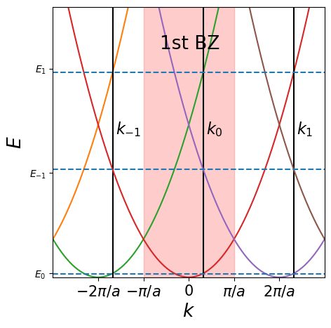

---
search:
  exclude: true
---

# The nearly free electron model

## Exercises

#### Exercise 1: Bloch's theorem
Suppose we have a crystal with lattice vectors $\mathbf{a}_ 1$, $\mathbf{a}_ 2$, and $\mathbf{a}_ 3$.

  1. What can be said about the symmetry of the Hamiltonian $\hat{H}$ of this crystal?

    It must obey the crystal symmetry, such as the translational symmetry of the lattice described by the lattice vectors $\mathbf{a}_1, \mathbf{a}_2$ and $\mathbf{a}_3$.

  2. Now define the translation operator $\hat{T}_{\alpha,\beta,\gamma}$ so that $$\hat{T}_{\alpha,\beta,\gamma} \psi(\mathbf{r}) = \psi(\mathbf{r} - \alpha \mathbf{a}_1 - \beta \mathbf{a}_2 - \gamma \mathbf{a}_3),$$ where $\alpha$, $\beta$, $\gamma$ are integers. Show that $\hat{T}_{\alpha,\beta,\gamma}$ and $\hat{H}$ commute.

    From the periodicity of the wavefunction with the real space lattice vectors, it follows that the kinetic part of the Hamiltonian, here denoted $\hat{K}$, will commute with the translation operator $\hat{T}_{\alpha, \beta, \gamma}$.

    \begin{align*}
    [\hat{T}_{\alpha,\beta,\gamma},\hat{H}]&= \left(V(\mathbf{r}-\alpha \mathbf{a}_1-\beta \mathbf{a}_2 - \gamma \mathbf{a}_3)-V(\mathbf{r})\right)\hat{T}_{\alpha,\beta,\gamma}=0\\
    \end{align*}

    Where we used that the lattice potential is periodic with integer lattice constants.

  3. Show that the Bloch wavefunctions defined in the lecture notes are eigenfunctions of $\hat{T}_{\alpha,\beta,\gamma}$. What are the corresponding eigenvalues? What does this say about the eigenfunctions of $\hat{H}$.

    \begin{align*}
    \hat{T}_{\alpha,\beta,\gamma}u_n(\mathbf{r})e^{i\mathbf{k}\cdot\mathbf{r}}&=e^{-i\mathbf{k}\cdot (\alpha \mathbf{a}_1+\beta \mathbf{a}_2 + \gamma \mathbf{a}_3)} u_n(\mathbf{r})e^{i\mathbf{k}\cdot \mathbf{r}}\\
    \end{align*}

    The eigenfunctions of $\hat{H}$ must also be Bloch waves.

  4. By applying $\hat{H}$ to the Bloch wavefunction, show that the Schrödinger equation can be rewritten as $$\left[ \frac{\mathbf{\hat{p}}^2}{2m} + \frac{\hbar}{m} \mathbf{k} \cdot \mathbf{\hat{p}} + \frac{\hbar^2 \mathbf{k}^2}{2m} + V(\mathbf{r}) \right] u_{n,\mathbf{k}}(\mathbf{r}) = E_{n,\mathbf{k}} u_{n,\mathbf{k}}(\mathbf{r}),$$ where $\mathbf{\hat{p}} =-i\hbar\nabla$.

    \begin{equation*}
    \nabla^2\psi_n(\mathbf{r})=e^{i\mathbf{k}\cdot\mathbf{r}}\left[ \nabla^2 u_n(\mathbf{r})-k^2u_n(\mathbf{r})+2i\mathbf{k}\nabla u_n(\mathbf{r}) \right].
    \end{equation*}

    Once this is explicitly written in the Schr. eqn, the complex exponentials cancel out.

  5. What is $u_{n,\mathbf{k}}(\mathbf{r})$ in case of free electrons? Is your answer consistent with the equation above?

    $u_n(\mathbf{r})$ becomes a normalization constant that is independent of position. Hence, the momentum operators return zero, and the only term that remains is $\hbar^2k^2/2m$ (which is indeed the free electron dispersion).

#### Exercise 2: the central equation in 1D
Let's consider a 1D crystal with a period $a$. Let $k_0$ be any wave number of an electron in the first Brillouin zone.

  1. What $k_n$ are equivalent to $k_0$ in this crystal?

    All $k_n$ that differ by an integer multiple of $2\pi/a$ from $k_0$ have the exact same wavefunction.

  2. First, we assume that the electrons with these $k_n$ are free. In that case, what are the wavefunctions $\phi_n(x)$ and energies $E_n$ of these electrons?

    \begin{equation*}
    \phi_n(x)=\frac{1}{\sqrt{\Omega}} \exp\left[i \left(k_0+\frac{2\pi n}{a}\right)x \right]
    \end{equation*}

    \begin{equation}
    E_n=\frac{\hbar^2}{2m}\left(k_0+\frac{2\pi n}{a}\right)^2
    \end{equation}

  3. Make a sketch of the dispersion relation using a repeated Brillouin zone representation. Indicate some $k_n$ and $E_n$ as well as the first Brillouin zone in your sketch.

  {: .center}

  We will now introduce a weak periodic potential $V(x) = V(x+na)$ in our system. This causes coupling between eigenstates $\left| \phi_n\right>$ in the free electron case. In order to find the right eigenstates of the system with that potential, we need an 'LCAO-like' trial eigenstate given by $$\left|\psi\right> = \sum_{n=-\infty}^{\infty}C_n \left|\phi_n\right>$$

  4. Using the trial eigenstate above and the Schrödinger equation, show that $$E C_m = \varepsilon_m C_m+\sum_{n=-\infty}^{\infty} V_{n}C_{m-n},$$ where $V_n$ are the Fourier components of the potential defined [above](#physical-meaning-of-w). Find an expression for $\varepsilon_m$. _**NB:** This equation is also known as the central equation (in 1D)._

    ??? hint
        - Apply $\left<\phi_m\right|$ to the Schrödinger equation.
        - To evaluate $\left<\phi_m\right| \hat{H} \left| \phi_n\right>$, it may be helpful to separate the kinetic energy and potential energy of the Hamiltonian.

    First the kinetic term,

    \begin{equation}
    \left\langle\phi_m|\hat{K}|\phi_n\right\rangle=C_m\frac{\hbar^2k_m^2}{2m}
    \end{equation}

    And the potential term,

    \begin{align}
    \left\langle\phi_m|V(x)|\psi\right\rangle=\sum_{n=-\infty}^{\infty}C_n\int_0^a V(x) e^{-i\frac{2\pi}{a}(m-n)x}dx
    \end{align}

    then relabel indices and combine both expressions to find the final answer and expression for $\varepsilon_m$ (which is the free electron dispersion).

  5. Why is the dispersion relation only affected near $k=0$ and at the edge of the Brillouin zone (see also figures [above](#repeated-vs-reduced-vs-extended-brillouin-zone))?

    ??? hint
        To answer this question, only consider two free electron wavefunctions in the Hamiltonian and ignore all the others. Between what two of free electron wavefunctions does the coupling give significant contribution to the energy levels of the free electron wavefunctions?

        From the expression for the energy, it is clear that the difference with respect to the free electron model is given by the Fourier component $V_{m-n}$, describing the coupling between two states $m$ and $n$. The question becomes: when does this term contribute significantly? For that we look at two orthogonal states $\phi_n$ and $\phi_m$, and construct the Hamiltonian in the basis ($\phi_n$,$\phi_m$),  

      \begin{equation}
      \hat{H}=
      \begin{pmatrix}
      \dfrac{\hbar^2 k_n^2}{2m} & V_{n-m}\\
      V_{m-n} & \dfrac{\hbar^2 k_m^2}{2m}
      \end{pmatrix}
      \end{equation}

      The eigenvalues of this fellow are

      \begin{equation}
      E=\frac{\hbar^2(k_n^2+k_m^2)}{4m}\pm\sqrt{\frac{\hbar^4}{16m^2}(k_n^2-k_m^2)^2+|V_{n-m}|^2}.
      \end{equation}

      This clearly displays that only if $|k_n|\approx |k_m|$, the band structure will be affected (given that the potential is weak, and therefore small). This nicely demonstrates how an avoided crossing arises.

#### Exercise 3: the tight binding model vs. the nearly free electron model
  Consider a 1D crystal with a periodic potential given by delta peaks: $$V(x) = -\lambda \sum_{n=-\infty}^{\infty} \delta(x+na),$$ where $\lambda>0$. In this exercise, we will find the band structure of this crystal in two ways:

  - By means of the nearly free electron model explained in this lecture.
  - By means of the [tight binding model](/3-1d/3-1-vibrations/).

<!-- A comment to separate two lists -->

  1. We first find the band structure using the nearly free electron model. To this end, we consider the effect of the potential on the free electron wavefunctions given by $\psi_1(x) \propto e^{ikx}$ and $\psi_2(x) \propto e^{i[k-2\pi/a]x}$ on the interval $k=[0,\pi/a]$. Derive a dispersion relation of the lower band using the Schödinger equation and the trial eigenstate $$\Psi(x) = \alpha \psi_1(x) + \beta \psi_2(x).$$

    ??? hint
        Using the Schrödinger equation and the trial eigenstate, first derive a 2×2 eigenvalue problem given by $$E \begin{pmatrix}\alpha \\ \beta\end{pmatrix} = \begin{pmatrix}\varepsilon_0(k)+V_0 & V_1^* \\ V_1 & \varepsilon_0(k - 2\pi/a) + V_0\end{pmatrix} \begin{pmatrix}\alpha \\ \beta\end{pmatrix}.$$ What are $\varepsilon_0(k)$, $V_0$ and $V_1$?

    We construct the Hamiltonian (note that we have exactly one delta-peak per unit cell of the lattice),

    \begin{equation*}
    \hat{H}=
    \begin{pmatrix}
    \left\langle\psi_1|\hat{H}|\psi_1\right\rangle & \left\langle\psi_1|\hat{H}|\psi_2\right\rangle\\
    \left\langle\psi_2|\hat{H}|\psi_1\right\rangle & \left\langle\psi_2|\hat{H}|\psi_2\right\rangle
    \end{pmatrix}
    \end{equation*}

    The bottom band means we have to pick the lowest energy band, i.e. the dispersion with the lowest eigenvalues, which is

    \begin{equation*}
    E_-(k) = -\frac{\lambda}{a}+\frac{\hbar^2}{4m}\left[k^2+\left(k-\frac{2\pi}{a}\right)^2 \right]-\sqrt{\left(\frac{\hbar^2}{4m}\left[k^2-\left(k-\frac{2\pi}{a}\right)^2 \right]\right)^2 + \left(\frac{\lambda}{a}\right)^2}
    \end{equation*}

  2. Make a sketch of the lower band.

    See the notes.

  3. We now use a tight binding model approach to derive the dispersion relation.
    We know from that the corresponding dispersion is
    $$
    E = \varepsilon_0 - 2 t \cos (ka).
    $$
    Find an expression for $\varepsilon_0=\left<n\right| \hat{H} \left|n\right>$ and $-t=\left<n-1\right| \hat{H} \left| n \right>$, using the bound state wavefunction around a single $\delta$-peak, centered at site $n$: $$
    |n\rangle = \kappa e^{- \kappa | x-na | }
    , $$
    where $\kappa = -\frac{m \lambda}{\hbar^2}$.

    ??? hint

        To ease the calculating $\epsilon_0$ and $t$, calculate them for $| n = 0 \rangle $ and $ | n = 1 \rangle $.

        You may also make use of the results obtained in [here](/2-chemistry/2-1-chemistry/#exercise-2-application-of-the-lcao-model-to-the-delta-function-potential) or found on [wikipedia](https://en.wikipedia.org/wiki/Delta_potential).

    We split the Hamiltonian into two parts $H=H_n+H_{\overline{n}}$, where $H_n$ describes a particle in a single delta-function potential well, and $H_\hat{n}$ is the perturbation by the other delta functions:

    \begin{align}
    H_n = & \frac{-\hbar^2}{2m}\frac{\partial^2}{\partial x^2} - \lambda\delta(x-na) \\
    H_\overline{n} = & - \lambda \sum_{m\neq n}\delta(x-ma)
    \end{align}

    such that $H_n|n\rangle = \epsilon_0|n\rangle = -\hbar^2\kappa^2/2m |n\rangle$ with $\kappa=m\lambda/\hbar^2$. We can now calculate

    $$
    \langle n | H |n \rangle = \epsilon_0 + \langle n |H_\overline{n}|n\rangle
    $$

    Note that the last term represents the change in energy of the wavefunction $|n\rangle$ that is centered at the $n$-th delta function caused by the presence of the other delta functions. This term yields

    $$
    \langle n |H_\overline{n}|n\rangle = -\kappa \lambda \sum_{m \neq 0 }\int e^{-2\kappa|x|}\delta(x-ma)  = -\kappa \lambda \sum_{m \neq 0 } e^{-2\kappa|ma|} = -2\kappa\lambda(\frac{1}{1-e^{-2\kappa a}}-1)
    $$

    Note that the result should not depend on $n$, so we chose $n=0$ for convenience.

    Similarly, we can calculate

    $$
    \langle n-1 | H |n \rangle = \epsilon_0\langle n-1  |n \rangle + \langle n-1 |H_\overline{n}|n\rangle
    $$

    where $\langle n-1|n\rangle$ is the overlap between two neighbouring wavefunctions:

    $$
    \langle n-1|n\rangle = 2\kappa\int_0^\infty e^{-\kappa|x-a/2|}e^{-\kappa|x+a/2|} = e^{-\kappa a}(1+\kappa a)
    $$

    and

    \begin{align}
    \langle n-1|H_\overline{n}|n\rangle = & -\kappa \lambda \sum_{m \neq 0 }\int e^{-\kappa|x-a|} \delta(x-ma)  e^{-\kappa|x|} \\
    =& -\kappa \lambda \sum_{m \neq 0 } e^{-\kappa a|m-1|} e^{-\kappa a |m|} =-\kappa \lambda(e^{ka}+e^{-ka}) \sum_{m=1}^{m=\infty} e^{-2\kappa a m}
    \end{align}

    In the limit $\kappa a \gg 1$ (i.e., where the distance between the delta functions is large compared to the width of the isolated orbitals), the onsite energy becomes

    $$
    \langle n|H|n \rangle = \epsilon_0(1-4 e^{-2\kappa a})
    $$

    and the hopping becomes

    $$
    \langle n-1|H|n \rangle = \epsilon_0 (\kappa a  - 2) e^{-\kappa a} \approx \epsilon_0 \kappa a e^{-\kappa a}
    $$

  4. Compare the bands obtained in exercise 1 and 2: what are the minima and bandwidths (difference between maximum and minimum) of those bands?

    | .. | Lower Band minimum | Lower Band Width|
    | --- | --- | --- |
    | TB model | $\varepsilon_0-2t$ | $4t$|
    | NFE model | $E_-(0)$ | $E_{-}(\pi/2)-E_-(0)$ |

  5. For what $a$ and $\lambda$ is the nearly free electron model more accurate? And for what $a$ and $\lambda$ is the tight binding model more accurate?

    Notice which approximations were made! For large $\lambda a$, the tight binding is more accurate, while for small $\lambda a$, the nearly free electron model is more accurate. The transition point for the regimes lies around $\lambda a\approx \hbar^2/m$.
