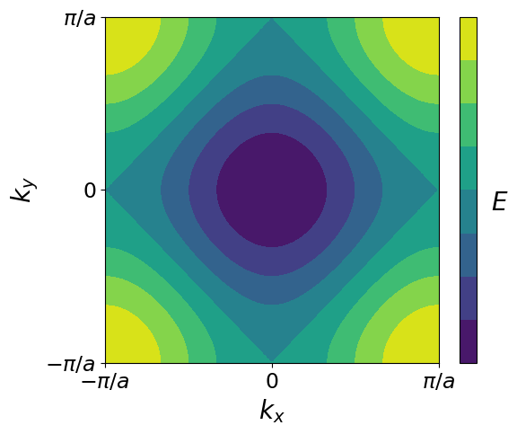

---
search:
  exclude: true
---

# Band structure

## Exercises

### Exercise 1: 3D Fermi surfaces
Using the [periodic table](../fermi_surfaces) of the Fermi surfaces (or the static images at https://www.phys.ufl.edu/fermisurface/ if 3D does not work for you), answer the following questions:

  1. Find 4 elements that are well described by the nearly-free electron model and 4 that are poorly described by it.

    Well described: (close to) spherical.

  2. Is the Fermi surface of lithium or potassium better described by the free electron model? What about nearly-free electron model? Why?

    K is more spherical, hence 'more' free electron model. Li is less spherical, hence 'more' nearly free electron model. Take a look at Au, and see whether you can link this to what you learned  in lecture 11.

  3. Do you expect a crystal with a simple cubic lattice and monovalent atoms to be conducting?

    Yes. Cubic -> unit cell contains one atom -> monovalent -> half filled band -> metal.

  4. What Fermi surface shape would you expect the [NaCl crystal](https://en.wikipedia.org/wiki/Sodium_chloride) to have? Explain your answer using both the atomic valences and the optical properties of this crystal.

    With Solid State knowledge: Na has 1 valence electron, Cl has 7. Therefore, a unit cell has an even number of electrons -> insulating.

    Empirical: Salt is transparent, Fermi level must be inside a large bandgap -> insulating.

### Exercise 2: Tight-binding in 2D

Consider a rectangular lattice with lattice constants $a_x$ and $a_y$.
Suppose the hopping parameters in the two corresponding directions to be $-t_1$ and $-t_2$.
Consider a single orbital per atom and only nearest-neighbour interactions.

  1. Write down a 2D tight-binding Schrödinger equation (expand to 2D the results of 1D).

    $$ E \phi_{n,m} = \varepsilon_0\phi_{n,m}-t_1 \left(\phi_{n-1,m}+\phi_{n+1,m}\right) -t_2 \left(\phi_{n,m-1}+\phi_{n,m+1}\right) $$

  2. Formulate the Bloch ansatz for the wave function.

    $$ \psi_n(\mathbf{r}) = u_n(\mathbf{r})e^{i\mathbf{k}\cdot\mathbf{r}} \quad \leftrightarrow \quad \phi_{n,m} = \phi_0 e^{i(k_x n a_x + k_y m a_y)}$$

  3. Calculate the dispersion relation of this model.

    $$ E = \varepsilon_0 -2t_1 \cos(k_x a_x) -2t_2 \cos(k_y a_y)$$

  4. What Fermi surface shape would this model have if the atoms are monovalent?

    Monovalent -> half filled bands -> rectangle rotated 45 degrees.

  5. What Fermi surface shape would it have if the number of electrons per atom is much smaller than 1?

    Much less than 1 electron per unit cell -> almost empty bands -> elliptical.

    {: .center}

### Exercise 3: Nearly-free Electron model in 2D
_(based on exercise 15.4 of the book)_

Suppose we have a square lattice with lattice constant $a$, with a periodic potential given by $V(x,y)=2V_{10}(\cos(2\pi x/a)+\cos(2\pi y/a))+4V_{11}\cos(2 \pi x/a)\cos(2 \pi y/a)$.

1. Use the Nearly-free electron model to find the energy of state $\mathbf{q}=(\pi/a, 0)$.

    ??? hint
        This is analogous to the 1D case: the states that interact have $k$-vectors $(\pi/a,0)$ and $(-\pi/a,0)$; ($\psi_{+}\sim e^{i\pi x /a}$ ; $\psi_{-}\sim e^{-i\pi x /a}$).

    Construct the Hamiltonian with basis vectors $(\pi/a,0)$ and $(-\pi/a,0)$, eigenvalues are

    $$ E=\frac{\hbar^2}{2m} \left(\frac{\pi}{a}\right)^2 \pm \left|V_{10}\right|. $$

2. Let's now study the more complicated case of  state $\mathbf{q}=(\pi/a,\pi/a)$. How many $k$-points have the same energy? Which ones?

    Four in total: $(\pm\pi/a,\pm\pi/a)$.

3. Write down the nearly free electron model Hamiltonian near this point.

    Define a basis, e.g.
    \begin{align}
    \left|0\right\rangle &= (\pi/a,\pi/a) \\
    \left|1\right\rangle &= (\pi/a,-\pi/a) \\
    \left|2\right\rangle &= (-\pi/a,-\pi/a) \\
    \left|3\right\rangle &= (-\pi/a,\pi/a)
    \end{align}
    The Hamiltonian becomes

    $$
    \hat{H}=
    \begin{pmatrix}
    \varepsilon_0 & V_{10} & V_{11} & V_{10} \\
    V_{10} & \varepsilon_0 & V_{10} & V_{11} \\
    V_{11} & V_{10} & \varepsilon_0 & V_{10} \\
    V_{10} & V_{11} & V_{10} & \varepsilon_0 \\
    \end{pmatrix}
    $$

4. Find its eigenvalues.

    Using the symmetry of the matrix, we try a few eigenvectors:
    $$
    \mathbf{v_\pm}=
    \begin{pmatrix}
    1 \\
    \pm 1 \\
    1 \\
    \pm 1 \\
    \end{pmatrix}
    $$
    $$
    \mathbf{v_\alpha}=
    \begin{pmatrix}
    \alpha \\
    1 \\
    -\alpha \\
    -1 \\
    \end{pmatrix}
    $$

    $$ E_\pm = \varepsilon_0 + V_{11} \pm 2 V_{10} \quad \text{and}\quad E_\alpha = \varepsilon_0 - V_{11} $$
